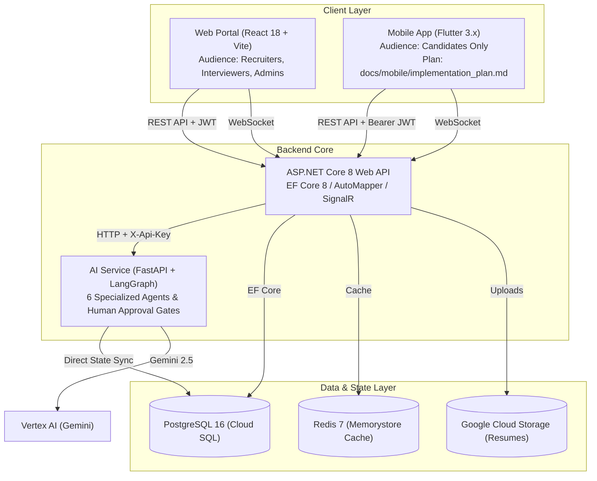

# HireWise

> **AI-Powered Tech Recruitment & Interview Scheduling Platform**

HireWise is an enterprise-grade recruitment automation platform that streamlines technical hiring through AI-driven candidate screening, automated interview scheduling, real-time feedback workflows, and multi-channel client experiences across Web and Mobile.

---

## 🏛️ Architecture Overview

The platform is structured as a polyglot monorepo comprising four core components backed by managed cloud infrastructure:



| Component | Path | Technology | Primary Audience | Description |
| :--- | :--- | :--- | :--- | :--- |
| **Backend API** | `apps/api` | ASP.NET Core 8 (.NET 8), EF Core, PostgreSQL, SignalR | All clients & services | Core REST API, business logic, multi-tenant persistence, real-time notification hubs. |
| **Web Portal** | `apps/web` | React 18, Vite, TypeScript, TailwindCSS, shadcn/ui, TanStack Query | Recruiters, Interviewers, Admins | Management dashboard for posting jobs, reviewing evaluations, scheduling rounds, and administrative control. |
| **Mobile App** | `apps/mobile` | Flutter 3, Dart, Riverpod, GoRouter, Dio, SignalR | **Candidates Only** | Dedicated mobile application for candidates to discover jobs, submit applications, manage resumes, track status, and view interview details. |
| **AI Service** | `apps/ai-service` | Python 3.11, FastAPI, LangGraph, Google Vertex AI (Gemini) | Backend API | Intelligent resume parsing, semantic scoring, question generation, and candidate evaluation agents. |

---

## 📚 Platform Documentation Directory

Comprehensive documentation has been prepared under the [`docs/`](docs/) directory:

- 🏛️ **[System Architecture](docs/architecture.md)**: Deep dive into microservices, data flow, and technology choices.
- 🗄️ **[Database & ERD Guide](docs/database.md)**: Entity-relationship diagram, table dictionary, soft delete, and query filtering.
- 🔌 **[API Reference Guide](docs/api.md)**: Comprehensive guide covering all 16 controllers, request/response envelopes, and SignalR hub contracts.
- 📬 **[Postman Collection](docs/postman_collection.json)**: Ready-to-import Postman collection with environments and variable bindings.
- 🤖 **[AI Architecture & LangGraph](docs/ai_architecture.md)**: StateGraph design, the 6 autonomous agents, and Human-in-the-Loop approval gates.
- 🔒 **[Security & Tenant Isolation](docs/security.md)**: Clerk RS256 JWKS verification, RBAC matrix, and candidate confidentiality guards.
- 🧪 **[Testing Strategy](docs/testing.md)**: xUnit, pytest, Vitest, and Flutter test runner execution guides.
- 🚢 **[Deployment & DevOps](docs/deployment.md)**: Docker Compose and Google Cloud Platform (GCP) Terraform operations.
- 🎬 **[Live Demo Script](docs/demo_script.md)**: Step-by-step interactive walkthrough script across Web, Mobile, and AI services.
- 📱 **[Candidate Mobile Implementation Plan](docs/mobile/implementation_plan.md)**: Detailed 18-phase implementation plan for the Flutter mobile application.
- 📑 **[Architectural Decision Records (ADRs)](docs/adr/)**:
  - [ADR-0001: Polyglot Monorepo Architecture](docs/adr/0001-monorepo-structure.md)
  - [ADR-0002: Clerk Authentication & Hybrid Multi-Tenancy](docs/adr/0002-clerk-authentication-and-multitenancy.md)
  - [ADR-0003: Dedicated Flutter Mobile Candidate Application](docs/adr/0003-flutter-mobile-candidate-portal.md)
  - [ADR-0004: FastAPI & LangGraph StateGraph for AI Workflows](docs/adr/0004-fastapi-langgraph-ai-service.md)
  - [ADR-0005: EF Core Global Query Filters for Soft-Delete & Tenant Isolation](docs/adr/0005-efcore-postgresql-soft-delete-multitenancy.md)
  - [ADR-0006: Serverless Google Cloud Run & Terraform IaC](docs/adr/0006-gcp-terraform-cloudrun-deployment.md)

---

## 🚀 Quick Start (Local Development)

### 1. Start the Backend Infrastructure with Docker Compose
```bash
docker compose up -d
```
Starts PostgreSQL 16 (`5432`), Redis 7 (`6379`), ASP.NET Core API (`5101`), FastAPI AI Service (`8000`), and Web Client (`3000`).

### 2. Run Services Individually (Bare Metal)

#### Backend API (`apps/api`)
```bash
cd apps/api/HireWise.Api
dotnet run
```
API runs on `http://localhost:5101` (Swagger UI at `/swagger`).

#### AI Service (`apps/ai-service`)
```bash
cd apps/ai-service
poetry run uvicorn ai_service.main:app --reload --port 8000
```
AI service runs on `http://localhost:8000` (Docs at `/docs`).

#### Web Portal (`apps/web`)
```bash
cd apps/web
npm install
npm run dev
```
Web app runs on `http://localhost:5173`.

#### Candidate Mobile App (`apps/mobile`)
```bash
cd apps/mobile
flutter pub get
flutter run --dart-define-from-file=env.development.json
```
For Android emulator, `API_BASE_URL` is pre-configured to `http://10.0.2.2:5101/api`.

---

## 📱 Mobile Application (Phase 13-B)

The Flutter mobile application (`apps/mobile`) is designed specifically for **Candidates** with:
- **Clerk Authentication**: Bearer JWT token propagation across all REST and SignalR calls.
- **Candidate-Only Role Guard**: Automatic redirection of non-candidate accounts to the web portal with zero exposure of sensitive hiring data (internal evaluations, scores, question banks).
- **Live Notifications**: Real-time push updates via SignalR WebSockets.
- **Clean Architecture**: Modular feature structure powered by Riverpod state management and GoRouter redirection guards.
- **Separate Implementation Plan**: See [docs/mobile/implementation_plan.md](docs/mobile/implementation_plan.md) for full sprint details.

---

## 🛠️ Monorepo Makefile Commands

Run top-level Makefile tasks from the root directory:

```bash
# Mobile Tasks
make mobile-install   # Run flutter pub get
make mobile-analyze   # Run flutter analyze
make mobile-test      # Run unit and widget test suite
make mobile-format    # Run dart format check
make mobile-run       # Run Flutter app in development mode
```

---

## 🔒 Security & Privacy

- All endpoints authenticate using Clerk-issued JWTs with RS256 JWKS verification.
- Sensitive interviewer scoring and private recruiter notes are strictly filtered from all candidate-facing endpoints and mobile screens.
- SignalR connection tokens are securely verified before granting access to real-time notification streams.
- Full immutable audit logging of database mutating events stored in PostgreSQL.
