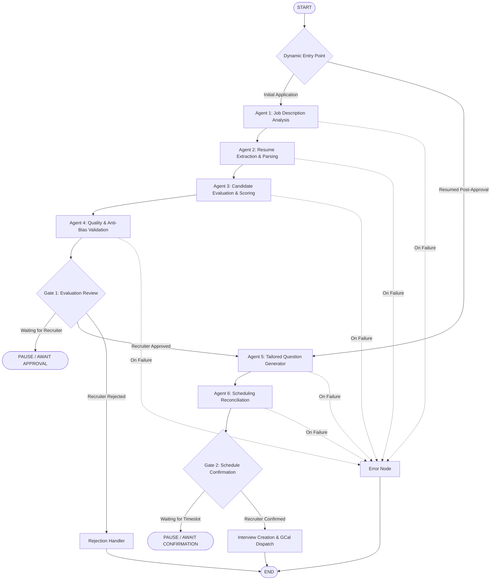

# HireWise — AI Architecture & Multi-Agent Orchestration

> **Version:** 1.0.0  
> **Framework:** FastAPI, LangGraph, Pydantic V2  
> **LLM Provider:** Google Cloud Vertex AI (Gemini 1.5 Pro / Flash)  
> **Target Audience:** AI Engineers, Backend Architects, Recruiter Operations

---

## 1. Architectural Philosophy

The HireWise AI Service (`apps/ai-service`) replaces opaque, single-shot LLM prompts with a **deterministic, auditable, and resilient StateGraph** orchestrated by **LangGraph**.

Key tenets:
1. **Separation of Concerns**: Six specialized agents execute discrete tasks with typed Pydantic contracts.
2. **Human-in-the-Loop (HITL) Gates**: The AI recommends; human recruiters decide. Execution pauses safely at approval gates until explicit confirmation is provided.
3. **Resumable State**: Graph states are persisted in PostgreSQL, enabling workflows to pause, resume, or retry failed steps without restarting from scratch.
4. **Defensive Validation**: Dedicated validation agents audit scores against hallucinations, demographic bias rules, and scoring thresholds.

---

## 2. LangGraph StateGraph Architecture

The recruitment lifecycle is modeled as a compiled `StateGraph` with two distinct stages and human-in-the-loop pauses:



---

## 3. The 6 Specialized Agents

### 3.1 Job Analysis Agent (`job_analysis_agent.py`)
- **Objective:** Parses raw job posting markdown/text into structured evaluation rubrics.
- **Inputs:** `JobTitle`, `Description`, `Requirements`, `ExperienceLevel`.
- **Outputs:** Pydantic `JobAnalysisOutput`:
  - Required technical competencies with weights (0.0–1.0).
  - Minimum years of experience and education level.
  - Behavioral traits and key domain challenges.

### 3.2 Resume Analysis Agent (`resume_analysis_agent.py`)
- **Objective:** Extracts candidate background from PDF, DOCX, or snapshot text.
- **Inputs:** Document bytes or pre-parsed raw resume text.
- **Outputs:** Pydantic `ResumeAnalysisOutput`:
  - Verified work history timeline with roles and companies.
  - Academic credentials and certifications.
  - Inferred technical skills categorized by proficiency level.

### 3.3 Candidate Evaluation Agent (`candidate_evaluation_agent.py`)
- **Objective:** Computes semantic match against the job analysis rubric.
- **Inputs:** `JobAnalysisOutput`, `ResumeAnalysisOutput`.
- **Outputs:** Pydantic `EvaluationOutput`:
  - Technical Match Score (0–100%).
  - Experience Alignment Score (0–100%).
  - Identified strengths, gaps, and compensation feasibility.
  - Overall Recommendation: `STRONG_HIRE`, `HIRE`, `NO_HIRE`, `STRONG_NO_HIRE`.

### 3.4 Validation Agent (`validation_agent.py`)
- **Objective:** Quality assurance layer guarding against hallucinations and scoring bias.
- **Checks:**
  - Mathematical integrity (overall score must logically align with sub-scores).
  - Exclusion of demographic keywords (age, gender, ethnicity, location).
  - Flags borderline scores (e.g., 68–72%) for mandatory manual recruiter review.

### 3.5 Interview Question Generator Agent (`question_generator_agent.py`)
- **Objective:** Dynamically formulates structured interview questions tailored specifically to the candidate's detected weaknesses and background.
- **Outputs:** List of `InterviewQuestion`:
  - Technical deep-dives targeting missing skills.
  - Behavioral questions probing past project complexity.
  - Expected benchmark answers and scoring rubrics for the interviewer.

### 3.6 Scheduling Agent (`scheduling_agent.py`)
- **Objective:** Matches candidate availability against interviewer Google Calendar schedules.
- **Outputs:** Optimal proposed meeting slots, conflict detection, and timezone alignment.

---

## 4. State Persistence & Data Contracts

The workflow state is defined by the `EvaluationState` schema:

```python
class EvaluationState(TypedDict, total=False):
    workflow_id: str
    application_id: str
    job_id: str
    candidate_id: str
    current_step: str
    
    # Artifacts accumulated through execution
    job_analysis: dict
    resume_analysis: dict
    evaluation: dict
    validation_result: dict
    questions: list[dict]
    scheduling_slots: list[dict]
    
    # Gate Decisions
    evaluation_approval: Optional[str]  # "APPROVED" | "REJECTED" | None
    schedule_approval: Optional[str]    # "APPROVED" | "REJECTED" | None
    
    # Error Context
    error: Optional[str]
    retry_count: int
```

State changes are immediately synced to PostgreSQL `AiWorkflows` and `AiWorkflowSteps` tables using native `jsonb` columns.

---

## 5. Runtime Model Configuration & Tuning

Admins can adjust LLM prompts, model selection, temperature, and token budgets on a per-agent basis via the Web Portal (`/admin/agent-config`):

| Agent Key | Default Model | Temperature | Max Tokens | Purpose |
|---|---|---|---|---|
| `job_analysis` | `gemini-1.5-flash` | 0.1 | 2048 | Deterministic taxonomy extraction |
| `resume_analysis` | `gemini-1.5-flash` | 0.0 | 4096 | Faithful timeline and skill parsing |
| `candidate_eval` | `gemini-1.5-pro` | 0.2 | 4096 | Deep semantic reasoning and gap analysis |
| `validation` | `gemini-1.5-flash` | 0.0 | 2048 | Strict schema and constraint compliance |
| `question_gen` | `gemini-1.5-pro` | 0.4 | 4096 | Creative, customized technical questioning |
| `scheduling` | `gemini-1.5-flash` | 0.0 | 2048 | Conflict-free timeslot selection |
