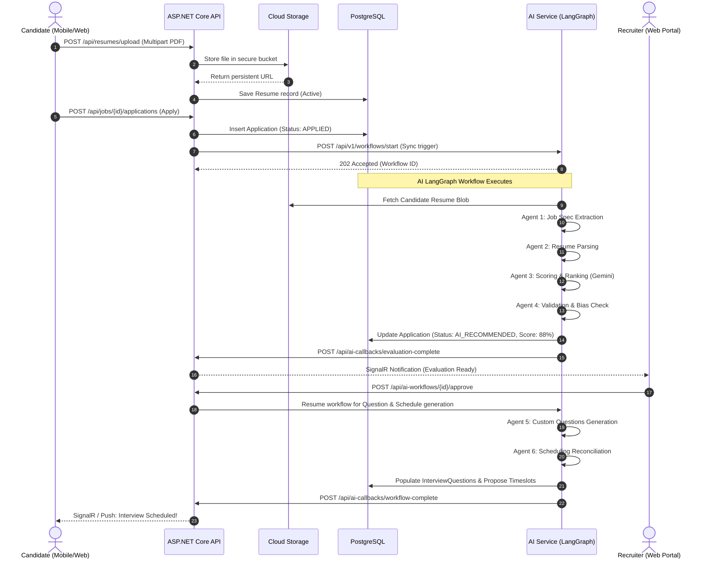

# HireWise — System Architecture Documentation

> **Version:** 1.0.0  
> **Status:** Approved / Production-Ready  
> **Target Audience:** Architects, Core Engineers, DevOps, Contributors

---

## 1. Executive Summary

**HireWise** is an enterprise-grade, AI-powered tech recruitment and interview scheduling platform. It automates end-to-end technical hiring workflows—from intelligent candidate screening and semantic resume parsing to automated interview scheduling, real-time notification streams, and structured interviewer rubrics.

The platform employs a **polyglot, distributed monorepo architecture** designed for high throughput, sub-second API latencies, rigorous tenant isolation, and multi-channel client experiences across Web and Mobile.

---

## 2. High-Level Architecture

HireWise separates responsibilities across four application boundaries, backed by managed cloud infrastructure:

```mermaid
graph TB
    subgraph Clients["Client Layer"]
        Web["Web Portal (React 18 + Vite)<br/>Audience: Recruiters, Interviewers, Admins"]
        Mobile["Mobile App (Flutter 3.x)<br/>Audience: Candidates Only<br/>Plan: docs/mobile/implementation_plan.md"]
    end

    subgraph GatewayAuth["Identity & Real-Time Gateway"]
        Clerk["Clerk Auth (JWKS / Org Multi-Tenancy)"]
        SignalR["SignalR Notification Hub (/hubs/notifications)"]
    end

    subgraph BackendAPI["Backend Core (apps/api)"]
        API["ASP.NET Core 8 Web API<br/>EF Core 8 / AutoMapper / FluentValidation"]
        ContextMW["User & Tenant Middleware<br/>(CompanyId / OrgId Resolution)"]
    end

    subgraph AIService["AI Intelligence Core (apps/ai-service)"]
        FastAPI["FastAPI Orchestrator<br/>Pydantic V2 / Uvicorn"]
        LangGraph["LangGraph Workflow Engine<br/>6 Specialized Agents & Human Approval Gates"]
    end

    subgraph DataStorage["Data & State Layer"]
        Postgres[("PostgreSQL 16 (Cloud SQL / Supabase)<br/>App Schema & LangGraph State")]
        Redis[("Redis 7 (Memorystore)<br/>Cache & Rate Limiting")]
        GCS[("Google Cloud Storage (GCS)<br/>Resume PDF/DOCX Snapshots")]
    end

    subgraph ExternalIntegrations["External Cloud Services"]
        Vertex["Google Cloud Vertex AI<br/>Gemini 1.5 Pro / Flash Models"]
        GCal["Google Calendar API<br/>ADC & Service Account Integration"]
        Resend["Resend Transactional Email"]
    end

    %% Client Interactions
    Web -->|HTTPS / REST + JWT| API
    Web -->|WebSockets| SignalR
    Web -->|Clerk Components| Clerk

    Mobile -->|HTTPS / REST + Bearer JWT| API
    Mobile -->|WebSockets (?access_token=)| SignalR
    Mobile -->|Native Clerk Auth| Clerk

    %% Gateway & Middleware
    Clerk -.->|JWKS Token Validation| API
    Clerk -.->|Webhook Events| API
    API --- SignalR
    API --- ContextMW

    %% API to Storage & Services
    API -->|Npgsql / EF Core| Postgres
    API -->|StackExchange.Redis| Redis
    API -->|Google.Cloud.Storage| GCS
    API -->|Google Calendar SDK| GCal
    API -->|REST API| Resend

    %% API to AI Service
    API -->|HTTP REST (X-Api-Key)| FastAPI
    FastAPI --> LangGraph
    LangGraph -->|Direct DB Persistence| Postgres
    LangGraph -->|LLM Invocations| Vertex
    FastAPI -.->|Workflow Status Callbacks| API
```

---

## 3. Core Subsystems

### 3.1 Backend API (`apps/api/HireWise.Api`)

The backend is an **ASP.NET Core 8 Web API** structured using clean modular folders:

- **Controllers (`Controllers/`)**: 16 RESTful controllers exposing resource routes with standard response wrappers (`ApiResponse<T>` and `PagedResult<T>`).
- **Data & Persistence (`Data/`)**: EF Core DbContext with global query filters for soft deletion (`IsDeleted = false`) and tenant scoping (`CompanyId`).
- **Domain Models & DTOs (`Models/`, `DTOs/`)**: Rich domain entities mapped to clean contract transfer objects via AutoMapper.
- **Middleware Pipeline (`Middleware/`)**:
  - `GlobalExceptionMiddleware`: Translates uncaught exceptions into standardized RFC 7807 error responses.
  - `UserContextMiddleware`: Extracts Clerk user and organization IDs from the JWT claims, resolving or seeding database records and populating `ICurrentUserService`.
  - `AuditLogMiddleware`: Records all mutating requests (`POST`, `PUT`, `DELETE`, `PATCH`) with user IDs, timestamps, and IP addresses.
- **Real-Time Hub (`Hubs/NotificationHub.cs`)**: SignalR hub authenticating connections via query string JWTs, facilitating live event dispatches.

### 3.2 AI Service (`apps/ai-service`)

The AI service is built on **FastAPI** and **LangGraph**, providing deterministic, auditable multi-agent workflows:

- **LangGraph State Graph**: Directed graph representing the application evaluation lifecycle.
- **Agent Roles**:
  1. *Job Description Analysis Agent*: Extracts technical competencies, soft skills, seniority, and criteria weights.
  2. *Resume Parsing & Extraction Agent*: Parses PDF/DOCX blobs into structured work histories, education, and technical toolsets.
  3. *Candidate Evaluation & Ranking Agent*: Computes multidimensional semantic match scores (0–100%) against job rubrics.
  4. *Validation Agent*: Audits scoring logic against bias rules, hallucination heuristics, and schema constraints.
  5. *Interview Question Generator Agent*: Generates tailored behavioral and technical questions calibrated to candidate gaps.
  6. *Interview Scheduling Agent*: Reconciles candidate availability against interviewer slots.
- **LLM Engine**: Google Cloud Vertex AI (Gemini 1.5 Pro and Gemini 1.5 Flash) via ADC credentials.

### 3.3 Web Portal (`apps/web`)

An enterprise React client built for speed and accessibility:

- **Framework**: React 18, Vite 5, TypeScript.
- **UI & Design System**: Tailwind CSS, shadcn/ui (Radix UI primitives), Lucide icons, Dark/Light theme switching.
- **Server State**: TanStack Query (React Query) for cache synchronization, background re-fetching, and optimistic mutations.
- **Authentication**: `@clerk/clerk-react` with organization switching and customized onboarding flows for recruiters and interviewers.
- **Visuals & Metrics**: shadcn/ui Charts (Recharts wrapper) for recruiter pipeline velocity, evaluation distributions, and funnel analytics.

### 3.4 Candidate Mobile Client (`apps/mobile`)

A cross-platform Flutter mobile client dedicated exclusively to **Candidates**:

> [!NOTE]
> Detailed design decisions, sprint breakdowns, and execution steps for the mobile app are maintained in the dedicated plan: [docs/mobile/implementation_plan.md](file:///c:/nadil-dulnidu/HireWise/docs/mobile/implementation_plan.md).

- **Framework**: Flutter 3.x / Dart 3.x.
- **State Management**: **Riverpod** (`flutter_riverpod`) with compile-safe dependency injection and reactive providers.
- **Routing**: **GoRouter** featuring declarative route guards (`AuthGuard`, `RoleGuard`, `OnboardingGuard`).
- **HTTP Layer**: **Dio** with `AuthInterceptor` (JWT injection) and `ErrorInterceptor` (API error normalization).
- **Candidate Confidentiality Guard**: Strict UI and model filtering preventing interview questions, internal evaluation scores, and recruiter notes from reaching candidate screens.
- **Real-Time Stream**: Duplex WebSockets using `signalr_netcore` connected to `/hubs/notifications`.

---

## 4. Multi-Tenant Identity & Scoping Model

HireWise employs a hybrid multi-tenant structure reflecting real-world recruitment dynamics:

| Entity Role | Tenant Scope | Authentication Mechanism | Permission Boundary |
|---|---|---|---|
| **Platform Admin** | Platform-Wide (Global) | Clerk JWT (`role: ADMIN`) | Full visibility across all organizations, platform settings, audit logs, and agent configs. |
| **Recruiter** | Single Company (Tenant) | Clerk JWT with `org_id` | Can post jobs, review applicants, trigger AI workflows, and schedule rounds within their organization. |
| **Interviewer** | Single Company (Tenant) | Clerk JWT with `org_id` | Assigned to specific interviews; can view candidate resumes and submit structured rubrics. |
| **Candidate** | Global (Cross-Tenant) | Clerk JWT (`role: CANDIDATE`) | Universal profile; can apply to public jobs across any registered company. Confidential data is strictly hidden. |

### JWT Resolution Lifecycle

```
[Client Request: Web or Mobile]
       │
       │ Authorization: Bearer <Clerk JWT>
       ▼
[ASP.NET Core JWT Middleware]
       │ Verifies RS256 signature against Clerk JWKS endpoint
       │ Extracts claims: sub (ClerkUserId), org_id (ClerkOrgId), email, roles
       ▼
[UserContextMiddleware]
       │ Resolves internal User record from PostgreSQL
       │ If recruiter/interviewer: resolves and validates CompanyId via ClerkOrgId
       ▼
[Controller Action]
       │ Uses ICurrentUserService (UserId, CompanyId, Role)
       │ EF Core applies HasQueryFilter(e => e.CompanyId == _companyId)
       ▼
[PostgreSQL Database]
```

---

## 5. System Data Flow Matrix



---

## 6. Infrastructure & Deployment Topology

The entire platform is automated via **Terraform** on **Google Cloud Platform (GCP)**:

- **Networking**: VPC with private subnets, Serverless VPC Access connector, and Cloud NAT.
- **Compute**: Google Cloud Run v2 (containerized microservices with auto-scaling to zero).
- **Relational Data**: Google Cloud SQL for PostgreSQL 16 (private IP only, automated backups).
- **Caching & State**: Google Cloud Memorystore Redis 7 (private networking).
- **Object Storage**: Google Cloud Storage with uniform bucket-level access and CORS.
- **Secrets Management**: Google Secret Manager accessed via workload identities.
- **CI/CD Pipelines**: GitHub Actions deploying to Artifact Registry and Cloud Run via Workload Identity Federation (passwordless OIDC).

---

## 7. Technology Matrix Summary

| Component | Technology | Version | Purpose |
|---|---|---|---|
| **API Framework** | ASP.NET Core | .NET 8 LTS | Core REST API and business logic |
| **ORM** | Entity Framework Core | 8.0.x | Code-first data persistence |
| **Database** | PostgreSQL | 16 | Relational data and workflow states |
| **Cache** | Redis | 7.x | Output caching, rate limiting |
| **AI Framework** | LangGraph + FastAPI | Python 3.11 | Deterministic multi-agent workflows |
| **LLM Models** | Gemini 1.5 Pro / Flash | Vertex AI SDK | Resume parsing, evaluation, question generation |
| **Web Client** | React + Vite + TypeScript | React 18 / Vite 5 | Management web portal |
| **Mobile Client** | Flutter + Dart | Flutter 3.x | Native Android candidate application |
| **Authentication** | Clerk Auth | Native & Web SDKs | Identity, session management, organization multi-tenancy |
| **Real-time** | ASP.NET Core SignalR | .NET 8 / WebSocket | Real-time candidate and recruiter notifications |
| **Cloud Infrastructure** | Terraform | 1.9+ | Declarative Infrastructure as Code (GCP) |
