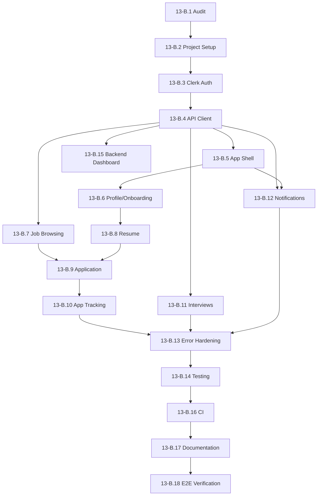

# Phase 13-B: Flutter Mobile Candidate Application — Implementation Plan

## Overview

Add a production-quality **Flutter mobile application for CANDIDATE users only** to the existing HireWise platform. The Flutter app is an additional client of the already-existing ASP.NET Core API, using the same **Clerk authentication**, **PostgreSQL database**, and **business logic** as the React web application.

> [!IMPORTANT]
> **No backend redesign.** The existing API already supports JWT Bearer authentication for all candidate endpoints. Only **one new endpoint** (`GET /api/users/me/dashboard`) is required.

---

## Repository Audit Findings

### Existing Architecture Confirmed

| Layer | Technology | Status |
|---|---|---|
| Web Client | React 19 + Vite + TailwindCSS + `@clerk/clerk-react` v5.61.9 | ✅ Working |
| API | ASP.NET Core (.NET 8) + EF Core + PostgreSQL | ✅ Working |
| AI Service | FastAPI + LangGraph + Vertex AI/Gemini | ✅ Working |
| Auth | Clerk JWT (JWKS resolution, Bearer tokens) | ✅ Working |
| Real-time | SignalR hub at `/hubs/notifications` | ✅ Working |
| File Storage | Local file storage (`/uploads/`) | ✅ Working |

### Candidate API Endpoints — All Exist

| Feature | Endpoint | Method | Auth |
|---|---|---|---|
| Get current user | `/api/users/me` | GET | Bearer |
| Update profile | `/api/users/me` | PUT | Bearer |
| Set role | `/api/users/me/role` | PUT | Bearer |
| Browse jobs (public) | `/api/jobs` | GET | AllowAnonymous |
| Job details | `/api/jobs/{id}` | GET | AllowAnonymous |
| Apply to job | `/api/jobs/{jobId}/applications` | POST | Bearer |
| My applications | `/api/applications/me` | GET | Bearer |
| Application details | `/api/applications/{id}` | GET | Bearer |
| Upload resume | `/api/resumes/upload` | POST | Bearer (multipart) |
| Active resume | `/api/resumes/me` | GET | Bearer |
| Resume by ID | `/api/resumes/{id}` | GET | Bearer |
| Delete resume | `/api/resumes/{id}` | DELETE | Bearer |
| My interviews | `/api/interviews/me` | GET | Bearer |
| Interview details | `/api/interviews/{id}` | GET | Bearer |
| Notifications | `/api/notifications` | GET | Bearer |
| Unread count | `/api/notifications/unread-count` | GET | Bearer |
| Mark read | `/api/notifications/{id}/read` | PUT | Bearer |
| Mark all read | `/api/notifications/read-all` | PUT | Bearer |
| Health check | `/api/health` | GET | None |

### API Response Format

All responses use `ApiResponse<T>`:
```json
{
  "success": true,
  "data": { ... },
  "message": "Optional message",
  "error": null,
  "timestamp": "2026-09-19T12:00:00Z",
  "correlationId": "abc123"
}
```

Paginated responses use `PagedResult<T>`:
```json
{
  "items": [...],
  "page": 1,
  "pageSize": 20,
  "totalCount": 50,
  "totalPages": 3,
  "hasPreviousPage": false,
  "hasNextPage": true
}
```

### Backend Auth Flow (No Changes Needed)

```
Flutter App
  ↓ Clerk sign-in → session token (JWT)
  ↓ Authorization: Bearer <JWT>
ASP.NET Core
  ↓ JwtBearerDefaults validates via ClerkJwksResolver (JWKS)
  ↓ UserContextMiddleware resolves ClerkUserId → DB User → Role
  ↓ [Authorize] policies enforce role
Controller
```

### Single Required Backend Change

> [!WARNING]
> **One new endpoint** is required: `GET /api/users/me/dashboard`
> Returns aggregated candidate dashboard data (active applications count, upcoming interviews, recent notifications, open jobs count).
> This is a **non-breaking addition** to the existing `UsersController`.

---

## Design Decisions (Confirmed)

| Decision | Choice |
|---|---|
| Clerk SDK | `clerk_flutter: ^0.0.18-beta` + `clerk_auth: ^0.0.18-beta` with pre-built `ClerkAuthentication` UI |
| State Management | **Riverpod** (`flutter_riverpod` + `riverpod_annotation`) |
| Routing | **go_router** with redirect guards |
| HTTP Client | **dio** with interceptors |
| Target Platform | **Android only** (initially) |
| JSON Serialization | `json_serializable` + `build_runner` |
| UI Theme | Material 3 with HireWise brand colors (#2563eb blue-600) |
| Notifications | **SignalR** via `signalr_netcore` (existing hub) |
| File Picker | `file_picker` for resume upload |
| Environment Config | `--dart-define-from-file` with `.env` files |
| Navigation | 5-tab bottom nav: Home, Jobs, Applications, Interviews, Profile |
| Non-candidate handling | "Not Authorized" screen with Sign Out |
| Onboarding | Auto-assign CANDIDATE role for new sign-ups |
| Interview questions | NOT visible to candidates |
| Testing | Unit + Widget tests with mockito/mocktail |

---

## Flutter Project Structure

```
apps/mobile/
├── .env.example
├── .env.development        # git-ignored
├── .gitignore
├── pubspec.yaml
├── analysis_options.yaml
├── android/
│   └── app/src/main/AndroidManifest.xml
├── lib/
│   ├── main.dart
│   ├── app/
│   │   ├── app.dart                    # MaterialApp + ClerkAuth wrapper
│   │   └── app_providers.dart          # Top-level Riverpod providers
│   ├── core/
│   │   ├── config/
│   │   │   └── env_config.dart         # Environment vars from --dart-define
│   │   ├── network/
│   │   │   ├── api_client.dart         # Dio instance + interceptors
│   │   │   ├── auth_interceptor.dart   # Bearer token injection
│   │   │   ├── error_interceptor.dart  # Error normalization
│   │   │   └── api_response.dart       # Generic ApiResponse<T> wrapper
│   │   ├── auth/
│   │   │   ├── auth_provider.dart      # Clerk auth state Riverpod provider
│   │   │   └── auth_guard.dart         # go_router redirect logic
│   │   ├── errors/
│   │   │   ├── app_exception.dart      # Typed exceptions
│   │   │   └── error_handler.dart      # Global error presentation
│   │   ├── routing/
│   │   │   └── app_router.dart         # go_router configuration
│   │   ├── theme/
│   │   │   └── app_theme.dart          # Material 3 theme + brand colors
│   │   └── constants/
│   │       └── api_endpoints.dart      # Centralized endpoint paths
│   ├── features/
│   │   ├── auth/
│   │   │   ├── presentation/
│   │   │   │   ├── sign_in_screen.dart
│   │   │   │   ├── auth_wrapper_screen.dart
│   │   │   │   └── unauthorized_screen.dart
│   │   │   └── providers/
│   │   │       └── auth_state_provider.dart
│   │   ├── onboarding/
│   │   │   ├── presentation/
│   │   │   │   └── onboarding_screen.dart
│   │   │   └── providers/
│   │   │       └── onboarding_provider.dart
│   │   ├── home/
│   │   │   ├── data/
│   │   │   │   ├── models/dashboard_data.dart
│   │   │   │   └── repositories/dashboard_repository.dart
│   │   │   ├── presentation/
│   │   │   │   └── home_screen.dart
│   │   │   └── providers/
│   │   │       └── dashboard_provider.dart
│   │   ├── jobs/
│   │   │   ├── data/
│   │   │   │   ├── models/
│   │   │   │   │   ├── job_dto.dart
│   │   │   │   │   ├── job_summary_dto.dart
│   │   │   │   │   └── job_filter_request.dart
│   │   │   │   └── repositories/
│   │   │   │       └── job_repository.dart
│   │   │   ├── presentation/
│   │   │   │   ├── jobs_screen.dart
│   │   │   │   ├── job_detail_screen.dart
│   │   │   │   ├── job_search_delegate.dart
│   │   │   │   └── widgets/
│   │   │   │       ├── job_card.dart
│   │   │   │       ├── job_filter_sheet.dart
│   │   │   │       └── job_detail_header.dart
│   │   │   └── providers/
│   │   │       └── jobs_provider.dart
│   │   ├── applications/
│   │   │   ├── data/
│   │   │   │   ├── models/
│   │   │   │   │   ├── application_dto.dart
│   │   │   │   │   └── apply_job_request.dart
│   │   │   │   └── repositories/
│   │   │   │       └── application_repository.dart
│   │   │   ├── presentation/
│   │   │   │   ├── applications_screen.dart
│   │   │   │   ├── application_detail_screen.dart
│   │   │   │   ├── apply_screen.dart
│   │   │   │   └── widgets/
│   │   │   │       ├── application_card.dart
│   │   │   │       └── status_timeline.dart
│   │   │   └── providers/
│   │   │       └── applications_provider.dart
│   │   ├── resume/
│   │   │   ├── data/
│   │   │   │   ├── models/
│   │   │   │   │   └── resume_dto.dart
│   │   │   │   └── repositories/
│   │   │   │       └── resume_repository.dart
│   │   │   ├── presentation/
│   │   │   │   └── widgets/
│   │   │   │       ├── resume_card.dart
│   │   │   │       └── upload_resume_sheet.dart
│   │   │   └── providers/
│   │   │       └── resume_provider.dart
│   │   ├── interviews/
│   │   │   ├── data/
│   │   │   │   ├── models/
│   │   │   │   │   ├── interview_dto.dart
│   │   │   │   │   └── interview_detail_dto.dart
│   │   │   │   └── repositories/
│   │   │   │       └── interview_repository.dart
│   │   │   ├── presentation/
│   │   │   │   ├── interviews_screen.dart
│   │   │   │   ├── interview_detail_screen.dart
│   │   │   │   └── widgets/
│   │   │   │       └── interview_card.dart
│   │   │   └── providers/
│   │   │       └── interviews_provider.dart
│   │   ├── notifications/
│   │   │   ├── data/
│   │   │   │   ├── models/
│   │   │   │   │   └── notification_dto.dart
│   │   │   │   └── repositories/
│   │   │   │       └── notification_repository.dart
│   │   │   │       └── signalr_service.dart
│   │   │   ├── presentation/
│   │   │   │   ├── notifications_screen.dart
│   │   │   │   └── widgets/
│   │   │   │       └── notification_tile.dart
│   │   │   └── providers/
│   │   │       └── notifications_provider.dart
│   │   └── profile/
│   │       ├── data/
│   │       │   ├── models/
│   │       │   │   ├── user_dto.dart
│   │       │   │   └── update_profile_request.dart
│   │       │   └── repositories/
│   │       │       └── user_repository.dart
│   │       ├── presentation/
│   │       │   ├── profile_screen.dart
│   │       │   ├── edit_profile_screen.dart
│   │       │   └── widgets/
│   │       │       └── profile_header.dart
│   │       └── providers/
│   │           └── profile_provider.dart
│   └── shared/
│       ├── models/
│       │   ├── enums.dart              # All domain enums
│       │   ├── paged_result.dart       # Generic pagination model
│       │   └── api_response.dart       # Generic response wrapper
│       ├── widgets/
│       │   ├── loading_indicator.dart
│       │   ├── error_view.dart
│       │   ├── empty_state.dart
│       │   ├── status_badge.dart
│       │   ├── salary_range.dart
│       │   ├── pull_to_refresh.dart
│       │   └── confirmation_dialog.dart
│       └── utils/
│           ├── date_formatter.dart
│           ├── currency_formatter.dart
│           └── validators.dart
├── test/
│   ├── core/
│   │   └── network/
│   │       └── api_client_test.dart
│   ├── features/
│   │   ├── auth/
│   │   │   └── auth_state_provider_test.dart
│   │   ├── jobs/
│   │   │   ├── job_repository_test.dart
│   │   │   └── jobs_screen_test.dart
│   │   ├── applications/
│   │   │   ├── application_repository_test.dart
│   │   │   └── applications_screen_test.dart
│   │   ├── resume/
│   │   │   └── resume_repository_test.dart
│   │   ├── interviews/
│   │   │   └── interview_repository_test.dart
│   │   ├── notifications/
│   │   │   └── notification_repository_test.dart
│   │   └── profile/
│   │       └── profile_provider_test.dart
│   └── shared/
│       └── models/
│           └── enums_test.dart
└── integration_test/
```

---

## Proposed Changes

### Backend (Minimal — 1 New Endpoint)

#### [MODIFY] [UsersController.cs](file:///c:/nadil-dulnidu/HireWise/apps/api/HireWise.Api/Controllers/UsersController.cs)

Add `GET /api/users/me/dashboard` endpoint:
- Returns `CandidateDashboardDto` with:
  - `activeApplicationsCount` (int)
  - `upcomingInterviews` (List\<InterviewDto\>, next 5)
  - `recentNotifications` (List\<NotificationDto\>, last 5)
  - `openJobsCount` (int)
- Uses existing services: `ApplicationService`, `InterviewService`, `NotificationService`, `JobService`
- Requires `[Authorize]`
- No new services, no schema changes

#### [NEW] DTOs/Users/CandidateDashboardDto.cs

```csharp
public class CandidateDashboardDto
{
    public int ActiveApplicationsCount { get; set; }
    public List<InterviewDto> UpcomingInterviews { get; set; } = new();
    public List<NotificationDto> RecentNotifications { get; set; } = new();
    public int OpenJobsCount { get; set; }
}
```

---

### Flutter Application (All New)

#### [NEW] `apps/mobile/` — Complete Flutter project

---

## Phase Breakdown

---

### PHASE 13-B.1 — Repository Audit

**Objective:** Verify existing backend endpoints, DTOs, auth flow, and identify any gaps.

**Existing files to inspect:**
- [Program.cs](file:///c:/nadil-dulnidu/HireWise/apps/api/HireWise.Api/Program.cs) — Auth config
- [UserContextMiddleware.cs](file:///c:/nadil-dulnidu/HireWise/apps/api/HireWise.Api/Middleware/UserContextMiddleware.cs) — User resolution
- [Entities.cs](file:///c:/nadil-dulnidu/HireWise/apps/api/HireWise.Api/Models/Entities.cs) — Data model
- All Controllers, DTOs, Enums
- [api-client.ts](file:///c:/nadil-dulnidu/HireWise/apps/web/src/lib/api-client.ts) — Web app auth pattern
- [useCurrentUser.ts](file:///c:/nadil-dulnidu/HireWise/apps/web/src/hooks/useCurrentUser.ts) — Web app user flow

**Files to create:** None
**Files to modify:** None
**Dependencies:** None

**Implementation tasks:**
- [x] Audit all 16 API controllers
- [x] Map candidate-accessible endpoints
- [x] Verify JWT Bearer auth flow works for non-browser clients
- [x] Confirm no CORS issues for mobile (native HTTP = no CORS)
- [x] Identify API gaps (found: dashboard aggregation endpoint)
- [x] Verify Clerk Flutter SDK API from documentation

**Acceptance criteria:**
- Complete endpoint map documented
- Backend compatibility confirmed
- Single API gap identified and planned

**Status: ✅ COMPLETE** (performed during this audit)

---

### PHASE 13-B.2 — Flutter Project Setup

**Objective:** Create the Flutter project in `apps/mobile/`, configure dependencies, environment, and Android manifest.

**Existing files to inspect:** `apps/mobile/` (empty)

**Files to create:**
- `apps/mobile/pubspec.yaml`
- `apps/mobile/analysis_options.yaml`
- `apps/mobile/.gitignore`
- `apps/mobile/.env.example`
- `apps/mobile/.env.development` (git-ignored)
- `apps/mobile/android/app/src/main/AndroidManifest.xml` (modify for internet permission)
- `apps/mobile/lib/main.dart`

**Dependencies:**
```yaml
dependencies:
  flutter:
    sdk: flutter
  clerk_flutter: ^0.0.18-beta
  clerk_auth: ^0.0.18-beta
  flutter_riverpod: ^2.6.1
  riverpod_annotation: ^2.6.1
  go_router: ^14.8.1
  dio: ^5.7.0
  json_annotation: ^4.9.0
  file_picker: ^8.1.7
  signalr_netcore: ^1.3.7
  intl: ^0.19.0
  cached_network_image: ^3.4.1
  url_launcher: ^6.3.1
  flutter_svg: ^2.0.17

dev_dependencies:
  flutter_test:
    sdk: flutter
  build_runner: ^2.4.13
  json_serializable: ^6.9.4
  riverpod_generator: ^2.6.3
  mockito: ^5.4.4
  mocktail: ^1.0.4
  riverpod_lint: ^2.6.3
  custom_lint: ^0.7.2
```

**Implementation tasks:**
1. Run `flutter create --org com.hirewise --project-name hirewise_mobile apps/mobile`
2. Configure `pubspec.yaml` with all dependencies
3. Set up `analysis_options.yaml` with strict rules
4. Create `.env.example` and `.env.development`
5. Configure Android manifest for internet permission
6. Set up basic `main.dart` with `ProviderScope` + `ClerkAuth`
7. Verify `flutter pub get` and `flutter analyze` pass
8. Verify `flutter run` launches on Android emulator

**Security considerations:**
- `.env.development` and `.env.production` must be in `.gitignore`
- Only `CLERK_PUBLISHABLE_KEY` and `API_BASE_URL` in env files
- No secrets, no API keys, no Clerk secret key

**Testing tasks:**
- Verify project compiles without errors
- Verify app launches on Android emulator

**Acceptance criteria:**
- `flutter pub get` succeeds
- `flutter analyze` passes with 0 errors
- App launches and shows a basic screen
- All dependencies resolve correctly

**Risks/Blockers:**
- `clerk_flutter` 0.0.18-beta may have API changes — verify against documentation
- Dart SDK version compatibility with clerk packages

---

### PHASE 13-B.3 — Clerk Authentication Integration

**Objective:** Implement Clerk authentication using `clerk_flutter`, supporting sign-in, sign-up, sign-out, and session management.

**Existing files to inspect:**
- Clerk Flutter SDK docs (quickstart, auth flows, configuration)
- [main.tsx](file:///c:/nadil-dulnidu/HireWise/apps/web/src/main.tsx) — Web Clerk setup pattern

**Files to create:**
- `lib/app/app.dart` — `ClerkAuth` wrapper + `MaterialApp`
- `lib/core/config/env_config.dart` — Environment config reader
- `lib/core/auth/auth_provider.dart` — Riverpod provider for auth state
- `lib/features/auth/presentation/auth_wrapper_screen.dart` — `ClerkAuthBuilder` signed-in/out routing
- `lib/features/auth/presentation/sign_in_screen.dart` — Wraps `ClerkAuthentication`
- `lib/features/auth/presentation/unauthorized_screen.dart` — Non-candidate message
- `lib/features/auth/providers/auth_state_provider.dart` — Auth + user role state

**Dependencies:** Phases 13-B.1, 13-B.2

**Implementation tasks:**
1. Create `EnvConfig` class reading from `--dart-define`
2. Wrap `MaterialApp` in `ClerkAuth(config: ClerkAuthConfig(publishableKey: ...))`
3. Use `ClerkAuthBuilder` for signed-in/signed-out branching
4. Use `ClerkAuthentication()` widget for sign-in/sign-up UI
5. Create `AuthStateProvider` that:
   - Reads `ClerkAuth.userOf(context)` and `ClerkAuth.sessionOf(context)`
   - Calls `GET /api/users/me` after sign-in to resolve backend role
   - Caches the user profile in Riverpod state
   - Handles session expiry and sign-out
6. Implement sign-out flow via `ClerkAuth.of(context).signOut()`
7. Handle auth error states (failed sign-in, expired session)
8. Create unauthorized screen for non-CANDIDATE users

**Security considerations:**
- Only publishable key in the app, NEVER secret key
- Token retrieved via `auth.sessionToken().jwt` — never stored manually
- Backend remains authoritative for role verification
- No role selection in the Flutter app

**Testing tasks:**
- Unit test: `EnvConfig` reads dart-defines correctly
- Unit test: `AuthStateProvider` transitions between loading/authenticated/unauthenticated
- Widget test: Unauthorized screen shows correct message and sign-out button
- Widget test: Auth wrapper routes correctly based on auth state

**Acceptance criteria:**
- User can sign in using Clerk pre-built UI
- User can sign up
- Session persists across app restarts
- Sign-out clears session and returns to sign-in
- Non-candidate users see unauthorized screen
- Session token is available for API calls

**Risks/Blockers:**
- Clerk Flutter SDK beta API may differ from docs
- OAuth sign-in requires native app configuration in Clerk Dashboard

---

### PHASE 13-B.4 — API Client & Authenticated Requests

**Objective:** Build centralized Dio-based API client with Bearer token injection, error handling, and correlation IDs.

**Existing files to inspect:**
- [api-client.ts](file:///c:/nadil-dulnidu/HireWise/apps/web/src/lib/api-client.ts) — Web app pattern
- [CorrelationIdMiddleware.cs](file:///c:/nadil-dulnidu/HireWise/apps/api/HireWise.Api/Middleware/CorrelationIdMiddleware.cs)
- [GlobalExceptionMiddleware.cs](file:///c:/nadil-dulnidu/HireWise/apps/api/HireWise.Api/Middleware/GlobalExceptionMiddleware.cs)

**Files to create:**
- `lib/core/network/api_client.dart` — Dio instance provider
- `lib/core/network/auth_interceptor.dart` — Injects `Authorization: Bearer <JWT>`
- `lib/core/network/error_interceptor.dart` — Maps HTTP errors to typed exceptions
- `lib/core/network/api_response.dart` — Generic `ApiResponse<T>` parser
- `lib/core/errors/app_exception.dart` — Typed exception hierarchy
- `lib/core/errors/error_handler.dart` — UI error presentation
- `lib/core/constants/api_endpoints.dart` — Centralized endpoint constants
- `lib/shared/models/api_response.dart` — Response wrapper model
- `lib/shared/models/paged_result.dart` — Pagination model
- `lib/shared/models/enums.dart` — All domain enums

**Dependencies:** Phase 13-B.3

**Implementation tasks:**
1. Create Dio instance with base URL from `EnvConfig`
2. Implement `AuthInterceptor`:
   - Gets session token via `ClerkAuth.of(context).sessionToken()`
   - Injects `Authorization: Bearer <jwt>` header
   - Generates `X-Correlation-ID` UUID per request
3. Implement `ErrorInterceptor`:
   - 401 → `UnauthorizedException` → redirect to sign-in
   - 403 → `ForbiddenException` → show unauthorized
   - 404 → `NotFoundException`
   - 409 → `ConflictException`
   - 422 → `ValidationException` with field errors
   - 429 → `RateLimitException`
   - 500 → `ServerException`
4. Create generic `ApiResponse<T>` parser matching backend format
5. Create `PagedResult<T>` model matching backend pagination
6. Create all domain enums matching [DomainEnums.cs](file:///c:/nadil-dulnidu/HireWise/apps/api/HireWise.Api/Models/Enums/DomainEnums.cs)
7. Set request timeout to 30 seconds
8. Configure Dio with `Content-Type: application/json`

**Security considerations:**
- Token injection via interceptor only (never manual)
- No credentials logged
- Correlation IDs for request tracing
- Timeout prevents hanging requests

**Testing tasks:**
- Unit test: `AuthInterceptor` adds Bearer header when token exists
- Unit test: `AuthInterceptor` skips header when no session
- Unit test: `ErrorInterceptor` maps each HTTP status to correct exception type
- Unit test: `ApiResponse<T>` parses success and error responses
- Unit test: `PagedResult<T>` parses pagination fields
- Unit test: Enum serialization/deserialization matches backend

**Acceptance criteria:**
- Authenticated API call to `/api/users/me` returns user data
- Unauthenticated call returns 401 and triggers sign-in redirect
- Correlation IDs appear in backend logs
- All HTTP error codes handled gracefully

**Risks/Blockers:**
- Token access requires `BuildContext` (Clerk uses widget tree) — need to bridge to Riverpod
- Android emulator `10.0.2.2` maps to localhost for API calls

---

### PHASE 13-B.5 — Candidate App Shell & Navigation

**Objective:** Build the main app shell with bottom navigation, go_router configuration, and auth-guarded routes.

**Files to create:**
- `lib/core/routing/app_router.dart` — go_router config
- `lib/core/theme/app_theme.dart` — Material 3 theme
- `lib/features/shell/presentation/app_shell.dart` — Scaffold + BottomNavigationBar
- `lib/features/shell/presentation/splash_screen.dart` — App loading screen

**Dependencies:** Phases 13-B.3, 13-B.4

**Implementation tasks:**
1. Create Material 3 theme with HireWise brand colors:
   - Primary: `#2563EB` (blue-600)
   - On Primary: `#FFFFFF`
   - Surface: `#FFFFFF`
   - On Surface: `#0F172A` (slate-900)
   - Secondary: `#475569` (slate-600)
   - Border: `#E2E8F0` (slate-200)
   - Font family: Roboto
2. Configure go_router with:
   - `/splash` → Splash screen (check auth)
   - `/auth` → Sign-in/Sign-up (Clerk UI)
   - `/unauthorized` → Non-candidate screen
   - `/onboarding` → New user onboarding
   - `/` → App shell with bottom nav
   - `/home` → Dashboard
   - `/jobs` → Job list
   - `/jobs/:id` → Job details
   - `/jobs/:id/apply` → Apply screen
   - `/applications` → Application list
   - `/applications/:id` → Application details
   - `/interviews` → Interview list
   - `/interviews/:id` → Interview details
   - `/profile` → Profile
   - `/profile/edit` → Edit profile
   - `/notifications` → Notification list
3. Implement auth redirect guard (unauthenticated → `/auth`)
4. Implement role guard (non-candidate → `/unauthorized`)
5. Implement onboarding guard (ONBOARDING status → `/onboarding`)
6. Build app shell with 5-tab bottom navigation
7. Add notification bell icon in AppBar with unread count badge

**Testing tasks:**
- Widget test: Bottom navigation renders 5 tabs
- Widget test: Tab switching changes displayed content
- Unit test: Auth redirect guard redirects unauthenticated users
- Unit test: Role guard redirects non-candidates

**Acceptance criteria:**
- App shows splash → sign-in → main shell flow
- Bottom navigation works with 5 tabs
- Tab state preserves when switching
- Notification badge shows unread count
- Theme matches HireWise brand

---

### PHASE 13-B.6 — Candidate Profile & Onboarding

**Objective:** Implement candidate onboarding for new users and profile management.

**Files to create:**
- `lib/features/onboarding/presentation/onboarding_screen.dart`
- `lib/features/onboarding/providers/onboarding_provider.dart`
- `lib/features/profile/data/models/user_dto.dart`
- `lib/features/profile/data/models/update_profile_request.dart`
- `lib/features/profile/data/repositories/user_repository.dart`
- `lib/features/profile/presentation/profile_screen.dart`
- `lib/features/profile/presentation/edit_profile_screen.dart`
- `lib/features/profile/presentation/widgets/profile_header.dart`
- `lib/features/profile/providers/profile_provider.dart`

**Dependencies:** Phases 13-B.4, 13-B.5

**Implementation tasks:**
1. Create `UserDto` model matching [UserDtos.cs](file:///c:/nadil-dulnidu/HireWise/apps/api/HireWise.Api/DTOs/Users/UserDtos.cs)
2. Create `UserRepository` with:
   - `getCurrentUser()` → `GET /api/users/me`
   - `updateProfile(request)` → `PUT /api/users/me`
   - `setRole(role)` → `PUT /api/users/me/role`
3. Onboarding screen:
   - Auto-calls `PUT /api/users/me/role` with `CANDIDATE`
   - Shows profile completion form (first name, last name, phone)
   - Calls `PUT /api/users/me` to save
   - Redirects to main app shell on completion
4. Profile screen:
   - Shows user info (name, email, phone, profile image)
   - Resume section (view active resume)
   - Account settings
   - Sign-out button
5. Edit profile screen with form validation

**Testing tasks:**
- Unit test: `UserDto` JSON parsing
- Unit test: `UserRepository` calls correct endpoints
- Widget test: Onboarding screen submits profile data
- Widget test: Profile screen displays user information
- Widget test: Sign-out button triggers sign-out flow

**Acceptance criteria:**
- New user sees onboarding screen after first sign-up
- Profile data saves and displays correctly
- User can edit their profile
- Sign-out works from profile screen

---

### PHASE 13-B.7 — Job Browsing, Search & Filtering

**Objective:** Implement job listing, search, filtering, and job details.

**Files to create:**
- `lib/features/jobs/data/models/job_dto.dart`
- `lib/features/jobs/data/models/job_summary_dto.dart`
- `lib/features/jobs/data/models/job_filter_request.dart`
- `lib/features/jobs/data/repositories/job_repository.dart`
- `lib/features/jobs/presentation/jobs_screen.dart`
- `lib/features/jobs/presentation/job_detail_screen.dart`
- `lib/features/jobs/presentation/job_search_delegate.dart`
- `lib/features/jobs/presentation/widgets/job_card.dart`
- `lib/features/jobs/presentation/widgets/job_filter_sheet.dart`
- `lib/features/jobs/presentation/widgets/job_detail_header.dart`
- `lib/features/jobs/providers/jobs_provider.dart`

**Dependencies:** Phase 13-B.4

**Implementation tasks:**
1. Create `JobSummaryDto` and `JobDto` matching [JobDtos.cs](file:///c:/nadil-dulnidu/HireWise/apps/api/HireWise.Api/DTOs/Jobs/JobDtos.cs)
2. Create `JobFilterRequest` with: status, employmentType, experienceLevel, search, minSalary, maxSalary
3. Create `JobRepository`:
   - `getPublicJobs(filter, page, pageSize)` → `GET /api/jobs`
   - `getJobById(id)` → `GET /api/jobs/{id}`
4. Jobs screen:
   - Paginated job list with infinite scrolling
   - Pull-to-refresh
   - Search bar (via `showSearch` + custom `SearchDelegate`)
   - Filter bottom sheet (employment type, experience level, salary range)
   - Job cards showing: title, company, location, salary, employment type, posted date
5. Job detail screen:
   - Full description, requirements
   - Company info (name, logo, location)
   - Salary range, experience level, employment type
   - Application deadline
   - "Apply Now" button (navigates to apply flow)

**Testing tasks:**
- Unit test: `JobSummaryDto` and `JobDto` JSON parsing
- Unit test: `JobRepository` builds correct query parameters
- Unit test: `JobFilterRequest` serialization
- Widget test: Job list renders cards
- Widget test: Job detail displays all fields
- Widget test: Filter sheet applies filters

**Acceptance criteria:**
- Job list loads with pagination
- Search filters jobs by keyword
- Filter sheet works for all filter types
- Job details display complete information
- "Apply Now" navigates to apply flow
- Empty state shown when no jobs match

---

### PHASE 13-B.8 — Resume Management

**Objective:** Implement resume upload, viewing, and deletion using device file picker.

**Files to create:**
- `lib/features/resume/data/models/resume_dto.dart`
- `lib/features/resume/data/repositories/resume_repository.dart`
- `lib/features/resume/presentation/widgets/resume_card.dart`
- `lib/features/resume/presentation/widgets/upload_resume_sheet.dart`
- `lib/features/resume/providers/resume_provider.dart`

**Dependencies:** Phase 13-B.6

**Implementation tasks:**
1. Create `ResumeDto` matching [ResumeDtos.cs](file:///c:/nadil-dulnidu/HireWise/apps/api/HireWise.Api/DTOs/Resumes/ResumeDtos.cs)
2. Create `ResumeRepository`:
   - `getActiveResume()` → `GET /api/resumes/me`
   - `getResumeById(id)` → `GET /api/resumes/{id}`
   - `uploadResume(file)` → `POST /api/resumes/upload` (multipart/form-data via Dio)
   - `deleteResume(id)` → `DELETE /api/resumes/{id}`
3. Resume card widget:
   - Shows file name, type, size, upload date
   - View/download button
   - Delete button with confirmation dialog
4. Upload resume bottom sheet:
   - Uses `file_picker` to select PDF/DOC/DOCX
   - Client-side validation: max 10MB, allowed types
   - Upload progress indicator
   - Success/error feedback
5. Integrate resume section in profile screen

**Security considerations:**
- Client-side file type and size validation (UX only — backend is authoritative)
- No storage of file contents in app state
- No exposure of upload paths/credentials

**Testing tasks:**
- Unit test: `ResumeDto` JSON parsing
- Unit test: `ResumeRepository` constructs multipart request correctly
- Widget test: Resume card displays file info
- Widget test: Upload sheet shows progress indicator

**Acceptance criteria:**
- User can select PDF/DOC/DOCX via file picker
- Upload shows progress indicator
- Active resume displays in profile
- Delete with confirmation works
- Error states handled (too large, wrong type, upload failure)

---

### PHASE 13-B.9 — Job Application Workflow

**Objective:** Implement the apply-to-job flow: select job → (optional cover letter) → review → submit → track.

**Files to create:**
- `lib/features/applications/data/models/application_dto.dart`
- `lib/features/applications/data/models/apply_job_request.dart`
- `lib/features/applications/data/repositories/application_repository.dart`
- `lib/features/applications/presentation/apply_screen.dart`
- `lib/features/applications/providers/applications_provider.dart`

**Dependencies:** Phases 13-B.7, 13-B.8

**Implementation tasks:**
1. Create `ApplicationDto` and `ApplicationDetailDto` matching [ApplicationDtos.cs](file:///c:/nadil-dulnidu/HireWise/apps/api/HireWise.Api/DTOs/Applications/ApplicationDtos.cs)
2. Create `ApplyJobRequest` (just `coverLetter` field)
3. Create `ApplicationRepository`:
   - `applyToJob(jobId, request)` → `POST /api/jobs/{jobId}/applications`
   - `getMyApplications(page, pageSize)` → `GET /api/applications/me`
   - `getApplicationById(id)` → `GET /api/applications/{id}`
4. Apply screen:
   - Shows job summary at top
   - Checks if user has an active resume (prompt upload if not)
   - Optional cover letter text field
   - Review step showing: job, resume, cover letter
   - Submit button with confirmation dialog
   - Success screen with "View Application" link
5. Handle errors:
   - Duplicate application (409 Conflict)
   - No resume uploaded
   - Job closed/expired
   - Validation errors

**Testing tasks:**
- Unit test: `ApplicationDto` JSON parsing
- Unit test: `ApplicationRepository` API calls
- Widget test: Apply screen validates resume presence
- Widget test: Submit triggers correct API call
- Widget test: Duplicate application shows error

**Acceptance criteria:**
- User can apply to a job with optional cover letter
- Duplicate application prevented with clear error
- Success confirmation shown after submit
- Application appears in "My Applications" list
- Backend validation errors displayed

---

### PHASE 13-B.10 — Application Tracking

**Objective:** Implement application list, detail view, and status tracking.

**Files to create:**
- `lib/features/applications/presentation/applications_screen.dart`
- `lib/features/applications/presentation/application_detail_screen.dart`
- `lib/features/applications/presentation/widgets/application_card.dart`
- `lib/features/applications/presentation/widgets/status_timeline.dart`

**Dependencies:** Phase 13-B.9

**Implementation tasks:**
1. Applications screen:
   - Paginated list of candidate's applications
   - Pull-to-refresh
   - Each card shows: job title, company, status badge, applied date
   - Tap to view details
2. Application detail screen:
   - Full job details (title, company, description, requirements)
   - Current application status with color-coded badge
   - Applied date, cover letter (if provided)
   - Resume snapshot link
   - Interview info if scheduled
3. Status timeline widget:
   - Visual progression: APPLIED → AI_REVIEW → RECRUITER_REVIEW → INTERVIEW_APPROVED → INTERVIEW_SCHEDULED → INTERVIEW_COMPLETED → SELECTED/REJECTED
   - Current step highlighted
   - Completed steps with checkmarks

**Testing tasks:**
- Widget test: Application list renders cards
- Widget test: Status timeline shows correct progression
- Widget test: Application detail displays all fields

**Acceptance criteria:**
- Applications list shows all candidate's applications
- Status badges use correct colors per status
- Timeline accurately represents application progress
- Pull-to-refresh updates data
- Empty state when no applications

---

### PHASE 13-B.11 — Interview Features

**Objective:** Show candidate's interviews with date/time, format, interviewer info, and status.

**Files to create:**
- `lib/features/interviews/data/models/interview_dto.dart`
- `lib/features/interviews/data/models/interview_detail_dto.dart`
- `lib/features/interviews/data/repositories/interview_repository.dart`
- `lib/features/interviews/presentation/interviews_screen.dart`
- `lib/features/interviews/presentation/interview_detail_screen.dart`
- `lib/features/interviews/presentation/widgets/interview_card.dart`
- `lib/features/interviews/providers/interviews_provider.dart`

**Dependencies:** Phase 13-B.4

**Implementation tasks:**
1. Create `InterviewDto` and `InterviewDetailDto` matching [InterviewDtos.cs](file:///c:/nadil-dulnidu/HireWise/apps/api/HireWise.Api/DTOs/Interviews/InterviewDtos.cs)
   - **Exclude** `ExpectedAnswer` from question models (not shown to candidates)
   - **Exclude** feedback data (interviewer-only)
2. Create `InterviewRepository`:
   - `getMyInterviews(page, pageSize)` → `GET /api/interviews/me`
   - `getInterviewById(id)` → `GET /api/interviews/{id}`
3. Interviews screen:
   - Split into "Upcoming" and "Past" tabs
   - Cards show: job title, date/time, interviewer name, status
   - Meeting link button (opens URL launcher)
4. Interview detail screen:
   - Full interview info (date/time, duration, status)
   - Job title and company
   - Interviewer name and email
   - Meeting link (tappable)
   - Status badge (SCHEDULED/IN_PROGRESS/COMPLETED/CANCELLED)
   - Notes (if any, candidate-safe only)
   - **No interview questions** (per design decision)
   - **No feedback details** (interviewer/recruiter only)

**Security considerations:**
- Never display `ExpectedAnswer` field
- Never display interviewer feedback/ratings
- Only show candidate-safe data from the API response

**Testing tasks:**
- Unit test: `InterviewDto` JSON parsing
- Unit test: `InterviewRepository` API calls
- Widget test: Interviews screen shows upcoming/past tabs
- Widget test: Interview detail displays correct info
- Widget test: Meeting link opens URL launcher

**Acceptance criteria:**
- Upcoming interviews shown with correct date/time
- Past interviews shown with final status
- Meeting link is tappable and opens in browser
- Interview details show all candidate-safe information
- No confidential interviewer data exposed

---

### PHASE 13-B.12 — Notifications

**Objective:** Implement notification list with real-time updates via SignalR.

**Files to create:**
- `lib/features/notifications/data/models/notification_dto.dart`
- `lib/features/notifications/data/repositories/notification_repository.dart`
- `lib/features/notifications/data/repositories/signalr_service.dart`
- `lib/features/notifications/presentation/notifications_screen.dart`
- `lib/features/notifications/presentation/widgets/notification_tile.dart`
- `lib/features/notifications/providers/notifications_provider.dart`

**Dependencies:** Phases 13-B.4, 13-B.5

**Implementation tasks:**
1. Create `NotificationDto` matching [NotificationDtos.cs](file:///c:/nadil-dulnidu/HireWise/apps/api/HireWise.Api/DTOs/Notifications/NotificationDtos.cs)
2. Create `NotificationRepository`:
   - `getNotifications(limit)` → `GET /api/notifications`
   - `getUnreadCount()` → `GET /api/notifications/unread-count`
   - `markAsRead(id)` → `PUT /api/notifications/{id}/read`
   - `markAllAsRead()` → `PUT /api/notifications/read-all`
3. Create `SignalRService`:
   - Connect to `/hubs/notifications?access_token=<JWT>`
   - Listen for `ReceiveNotification` events
   - Auto-reconnect on disconnect
   - Disconnect on sign-out
4. Notifications screen:
   - List of notifications sorted by date
   - Unread/read visual distinction
   - "Mark all as read" action
   - Tap notification → navigate to related entity (application, interview)
5. Notification bell badge in AppBar:
   - Shows unread count
   - Updates in real-time via SignalR
   - Taps to notification list

**Testing tasks:**
- Unit test: `NotificationDto` JSON parsing
- Unit test: `NotificationRepository` API calls
- Unit test: `SignalRService` connection/reconnection logic
- Widget test: Notification list renders tiles
- Widget test: Unread badge shows correct count

**Acceptance criteria:**
- Notification list displays all notifications
- Real-time updates via SignalR work
- Unread badge updates in real-time
- Mark as read/mark all works
- Tapping notification navigates to related screen
- SignalR reconnects after disconnection

**Risks/Blockers:**
- `signalr_netcore` package compatibility with SignalR hub version
- JWT token refresh during long SignalR connections

---

### PHASE 13-B.13 — Error Handling & Security Hardening

**Objective:** Ensure comprehensive error handling, security best practices, and production readiness.

**Files to modify:** All existing screens and providers

**Implementation tasks:**
1. Implement global error handler:
   - Catch unhandled exceptions
   - Show user-friendly error messages
   - Never display raw exception text or stack traces
2. Add loading/empty/error states to ALL screens:
   - Loading: Skeleton/shimmer or circular indicator
   - Empty: Descriptive illustration + message
   - Error: Retry button + user-friendly message
3. Handle specific error scenarios:
   - Network unavailable → "No internet connection" with retry
   - Session expired (401) → automatic sign-in redirect
   - Forbidden (403) → "Access denied" message
   - Rate limited (429) → "Too many requests, try again later"
   - Server error (500) → "Something went wrong, try again"
4. Security hardening:
   - Verify no secrets in codebase (grep for patterns)
   - Ensure no sensitive data in logs
   - Verify HTTPS for non-dev environments
   - File upload validation (type, size)
   - Ensure no client-supplied user IDs in requests

**Testing tasks:**
- Unit test: Error handler maps all exception types
- Widget test: Error state renders for each screen
- Widget test: Empty state renders for each list screen
- Widget test: Loading state renders during data fetch

**Acceptance criteria:**
- All screens handle loading, empty, and error states
- No raw exceptions shown to users
- 401 triggers automatic sign-in redirect
- No secrets in committed code
- Network errors handled gracefully

---

### PHASE 13-B.14 — Testing

**Objective:** Comprehensive unit and widget test suite.

**Files to create:** All test files in `test/` directory (listed in project structure)

**Dependencies:** All previous phases

**Implementation tasks:**
1. **Model tests:** Verify JSON serialization for all DTOs
2. **Repository tests:** Mock Dio, verify API calls and response parsing
3. **Provider tests:** Use Riverpod `ProviderContainer` overrides
4. **Widget tests:** Key screens with mocked providers
5. **Auth tests:**
   - Signed-out state routing
   - Signed-in state routing
   - Unauthorized role handling
   - Session restoration
6. **Navigation tests:**
   - Auth guard redirects
   - Deep link handling
   - Tab navigation persistence

**Acceptance criteria:**
- All model tests pass
- All repository tests pass
- All provider tests pass
- Key widget tests pass
- `flutter test` reports 0 failures
- Code coverage ≥ 60% for core modules

---

### PHASE 13-B.15 — Backend Dashboard Endpoint

**Objective:** Add the single new backend endpoint for candidate dashboard aggregation.

**Files to modify:**
- [UsersController.cs](file:///c:/nadil-dulnidu/HireWise/apps/api/HireWise.Api/Controllers/UsersController.cs) — Add dashboard action

**Files to create:**
- `DTOs/Users/CandidateDashboardDto.cs` — Dashboard response model

**Implementation tasks:**
1. Create `CandidateDashboardDto` with aggregated fields
2. Add `[HttpGet("me/dashboard")]` to `UsersController`
3. Implementation:
   - Get current user via `_currentUserService.ClerkUserId`
   - Count active applications (status not REJECTED/SELECTED)
   - Get next 5 upcoming interviews (ordered by `ScheduledStartTime`)
   - Get last 5 notifications
   - Count open jobs
4. Verify existing React web app is NOT broken
5. Verify Swagger shows new endpoint

**Testing tasks:**
- Manual test: Call endpoint via Swagger
- Verify response matches expected DTO shape

**Acceptance criteria:**
- `GET /api/users/me/dashboard` returns aggregated data
- Existing endpoints unaffected
- Swagger documentation updated
- React web app continues to work

---

### PHASE 13-B.16 — CI Integration

**Objective:** Add Flutter validation to the project's CI pipeline.

**Files to create:**
- `.github/workflows/flutter.yml` — Flutter CI workflow

**Implementation tasks:**
1. Create GitHub Actions workflow:
   ```yaml
   - flutter pub get
   - flutter analyze
   - flutter test
   - flutter build apk --release (optional, release builds)
   ```
2. Ensure workflow only triggers for changes in `apps/mobile/`
3. Cache Flutter SDK and pub packages for faster builds

**Acceptance criteria:**
- CI workflow runs on push/PR to `apps/mobile/`
- `flutter analyze` passes
- `flutter test` passes
- APK build succeeds (if configured)

---

### PHASE 13-B.17 — Documentation

**Objective:** Document the Flutter mobile architecture and update project documentation.

**Files to create:**
- `apps/mobile/README.md` — Mobile app documentation

**Files to modify:**
- `README.md` (root) — Add mobile app section
- `docs/implementation_plan.md` — Add Phase 13-B

**Documentation topics:**
1. Flutter architecture overview
2. Clerk Flutter authentication flow diagram
3. Candidate-only permission model
4. API integration architecture (Dio + interceptors)
5. Environment configuration guide
6. Local development setup (Android emulator + backend)
7. Android build instructions
8. Testing instructions
9. Auth troubleshooting guide
10. API compatibility requirements

**Acceptance criteria:**
- Mobile README is complete and accurate
- Root README updated to reference mobile app
- Architecture diagram shows Flutter as additional client
- Setup instructions verified to work

---

### PHASE 13-B.18 — Final End-to-End Verification

**Objective:** Verify the complete candidate workflow end-to-end.

**Verification scenario:**
1. ✅ Open Flutter app on Android
2. ✅ Clerk sign-in
3. ✅ Authenticated Clerk session
4. ✅ Backend recognizes user via Bearer JWT
5. ✅ Candidate role verified
6. ✅ Dashboard shows summary data
7. ✅ Browse jobs with search and filters
8. ✅ Open job details
9. ✅ Upload resume via file picker
10. ✅ Apply to job with cover letter
11. ✅ Track application status
12. ✅ View upcoming interview
13. ✅ View interview details (no questions shown)
14. ✅ Receive real-time notification via SignalR
15. ✅ Sign out
16. ✅ Same user signs into React web → sees same data

**Cross-client verification:**
- Candidate signs in on Web → creates application
- Same candidate signs in on Mobile → sees same application
- No duplicate user accounts

---

## Dependency Order



---

## Identified Risks & Mitigations

| Risk | Impact | Mitigation |
|---|---|---|
| `clerk_flutter` 0.0.18-beta has breaking changes | High | Pin exact version, read source if docs are outdated, have fallback to custom auth UI |
| SignalR Flutter package incompatibility | Medium | Fallback to polling-based notifications if `signalr_netcore` fails |
| Token bridging: Clerk widget context → Riverpod | Medium | Use `ProviderScope` overrides or a `ChangeNotifierProvider` bridge |
| Android emulator networking to localhost API | Low | Use `10.0.2.2` for emulator, document setup clearly |
| Large APK size from beta packages | Low | Profile and remove unused dependencies |

## Assumptions

1. The Clerk Dashboard has "Native applications" API enabled
2. The same Clerk publishable key works for both web and Flutter
3. The existing webhook configuration handles user creation for mobile sign-ups
4. The backend API is accessible from the development machine's network
5. Android SDK and Flutter SDK are installed on the development machine
