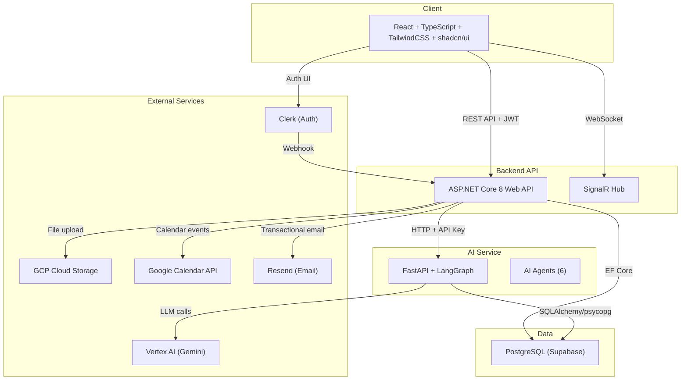
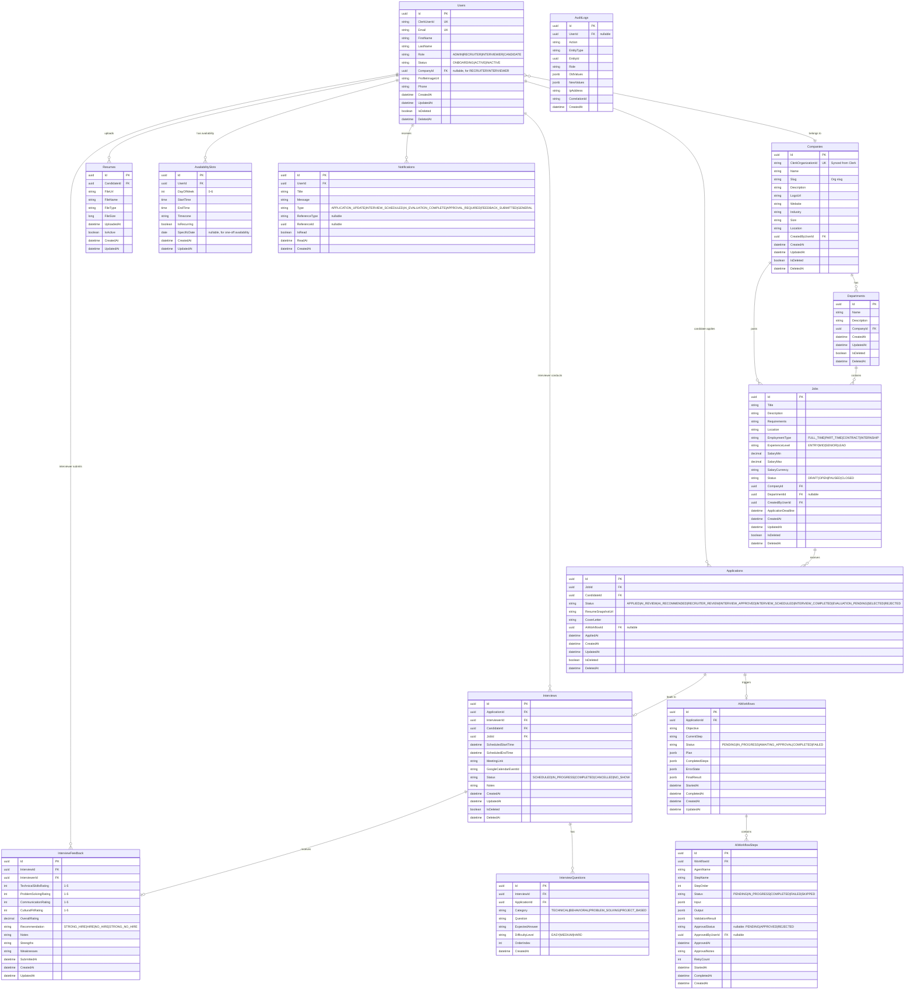
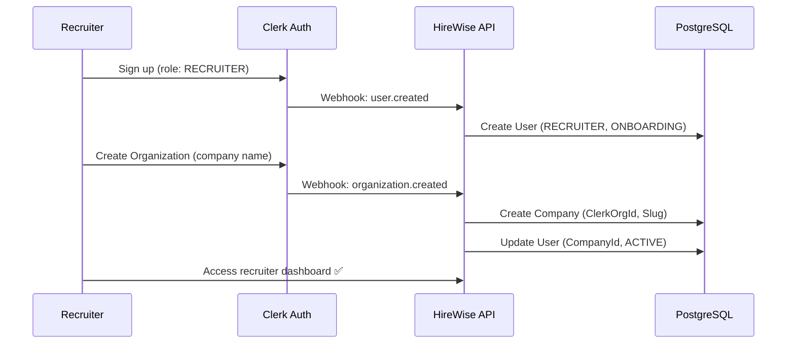
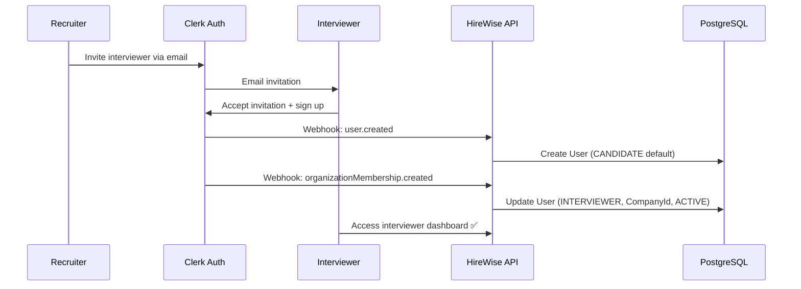
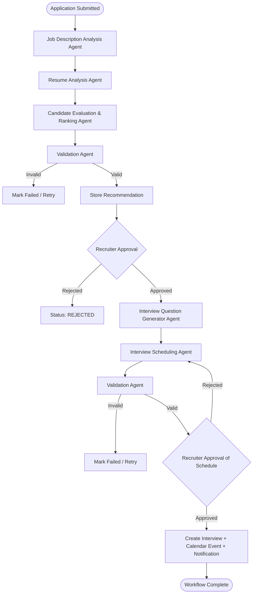
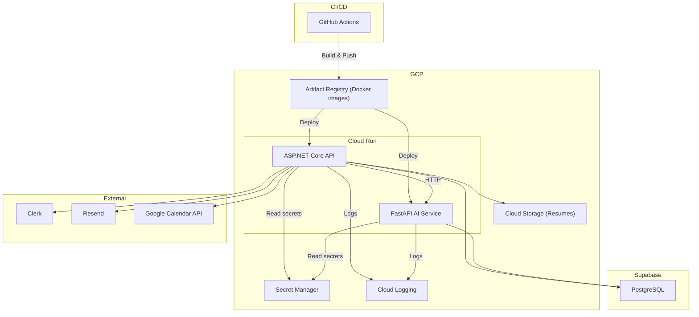

# HireWise — AI-Powered Tech Recruitment Platform

## Design Decisions Summary

All decisions below were resolved during the architecture interview.

| Decision                | Choice                                                         |
| ----------------------- | -------------------------------------------------------------- |
| .NET project structure  | Single project with folder-based separation                    |
| .NET version            | .NET 8 (LTS)                                                   |
| Secrets management      | `appsettings.Development.json` (local) + env vars (prod)       |
| Company model           | Multi-tenant, shared database with CompanyId column filtering  |
| Recruiter-company       | One recruiter → one company                                    |
| Candidate scope         | Global (platform-wide, can apply to any company)               |
| Interviewer scope       | Company-scoped, assigned by recruiter/admin                    |
| Resume handling         | File upload to GCP Cloud Storage, URL in DB                    |
| File storage            | GCP Cloud Storage                                              |
| LLM provider            | Google Vertex AI (Gemini models)                               |
| ASP.NET ↔ FastAPI      | Synchronous trigger + polling for status                       |
| AI workflow trigger     | Automatic on application submission                            |
| Service-to-service auth | API key in `X-Api-Key` header                                  |
| AI state persistence    | PostgreSQL (same Supabase DB)                                  |
| Calendar integration    | Google Calendar API                                            |
| Email service           | Resend                                                         |
| Notifications           | In-app (DB) + real-time via SignalR                            |
| User registration       | Open role selection + admin approval for Recruiter/Interviewer |
| Admin bootstrap         | Database seed script                                           |
| Interview structure     | Single round per candidate per job                             |
| Interview feedback      | Structured form (1-5 ratings + notes + recommendation)         |
| Interviewer assignment  | Recruiter selects manually                                     |
| Availability            | Stored in PostgreSQL, cross-checked with Google Calendar       |
| Final hiring decision   | Recruiter manual decision after reviewing feedback             |
| Frontend routing        | React Router v7 with layout-based nested routes                |
| UI theme                | Dark default + light toggle, minimalistic design               |
| State management        | TanStack Query (server) + Redux Toolkit (UI state only)        |
| Charts                  | shadcn/ui Charts (Recharts wrapper)                            |
| API docs                | Swagger/OpenAPI + Postman collection                           |
| Primary keys            | UUIDs (Guid)                                                   |
| Delete strategy         | Soft delete (IsDeleted + DeletedAt)                            |
| Company creation        | Recruiter + Admin can create companies                         |
| Departments             | Optional department FK on jobs                                 |
| Error handling          | Result pattern + global exception middleware                   |
| Job lifecycle           | DRAFT → OPEN → PAUSED → CLOSED                                 |
| Resume model            | One per candidate, snapshotted at application time             |
| Backend testing         | xUnit + Moq + FluentAssertions                                 |
| Frontend testing        | Vitest + React Testing Library                                 |
| AI testing              | pytest + httpx + pytest-asyncio                                |
| E2E testing             | Playwright                                                     |
| Logging                 | Serilog (structured, JSON)                                     |
| Rate limiting           | AspNetCoreRateLimit                                            |
| Request validation      | FluentValidation                                               |
| Object mapping          | AutoMapper                                                     |
| Pagination              | Offset-based on all list endpoints                             |
| Public pages            | Landing page with public job browse                            |

---

## Architecture Overview



---

## Database Schema (ERD)



---

## Onboarding Sequence Diagrams

### Recruiter Flow



### Interviewer Flow



---

## API Endpoint Plan

### Auth & Webhooks

| Method | Endpoint              | Auth            | Description                                                                  |
| ------ | --------------------- | --------------- | ---------------------------------------------------------------------------- |
| POST   | `/api/webhooks/clerk` | Clerk signature | Handle Clerk events (`user.*`, `organization.*`, `organizationMembership.*`) |

### Users

| Method | Endpoint                     | Auth              | Description                 |
| ------ | ---------------------------- | ----------------- | --------------------------- |
| GET    | `/api/users/me`              | Any authenticated | Get current user profile    |
| PUT    | `/api/users/me`              | Any authenticated | Update current user profile |
| GET    | `/api/users`                 | Admin             | List all users (paginated)  |
| GET    | `/api/users/{id}`            | Admin             | Get user details            |
| PUT    | `/api/users/{id}/role`       | Admin             | Update user role            |
| PUT    | `/api/users/{id}/deactivate` | Admin             | Deactivate user             |
| PUT    | `/api/admin/users/{id}/ban`  | Admin             | Ban/suspend abusive user    |

### Organizations & Team (Recruiter & Admin)

| Method | Endpoint                   | Auth      | Description                                       |
| ------ | -------------------------- | --------- | ------------------------------------------------- |
| GET    | `/api/admin/organizations` | Admin     | List all organizations across platform            |
| GET    | `/api/recruiter/team`      | Recruiter | Get organization team members with HireWise stats |

### Companies

| Method | Endpoint              | Auth                   | Description         |
| ------ | --------------------- | ---------------------- | ------------------- |
| GET    | `/api/companies`      | Admin, Recruiter       | List companies      |
| POST   | `/api/companies`      | Admin, Recruiter       | Create company      |
| GET    | `/api/companies/{id}` | Admin, Recruiter       | Get company details |
| PUT    | `/api/companies/{id}` | Admin, Recruiter (own) | Update company      |
| DELETE | `/api/companies/{id}` | Admin                  | Soft delete company |

### Departments

| Method | Endpoint                                 | Auth                   | Description            |
| ------ | ---------------------------------------- | ---------------------- | ---------------------- |
| GET    | `/api/companies/{companyId}/departments` | Admin, Recruiter       | List departments       |
| POST   | `/api/companies/{companyId}/departments` | Admin, Recruiter (own) | Create department      |
| PUT    | `/api/departments/{id}`                  | Admin, Recruiter (own) | Update department      |
| DELETE | `/api/departments/{id}`                  | Admin, Recruiter (own) | Soft delete department |

### Jobs

| Method | Endpoint                | Auth                                     | Description                                  |
| ------ | ----------------------- | ---------------------------------------- | -------------------------------------------- |
| GET    | `/api/jobs`             | Public (OPEN only) / Recruiter (all own) | List jobs (paginated, filterable)            |
| POST   | `/api/jobs`             | Recruiter                                | Create job                                   |
| GET    | `/api/jobs/{id}`        | Public (if OPEN) / Recruiter             | Get job details                              |
| PUT    | `/api/jobs/{id}`        | Recruiter (own)                          | Update job                                   |
| PUT    | `/api/jobs/{id}/status` | Recruiter (own)                          | Change job status (DRAFT→OPEN→PAUSED→CLOSED) |
| DELETE | `/api/jobs/{id}`        | Recruiter (own), Admin                   | Soft delete job                              |

### Resumes

| Method | Endpoint                     | Auth                                    | Description             |
| ------ | ---------------------------- | --------------------------------------- | ----------------------- |
| POST   | `/api/resumes/upload`        | Candidate                               | Upload resume (GCS)     |
| GET    | `/api/resumes/me`            | Candidate                               | Get current resume info |
| GET    | `/api/resumes/{id}/download` | Candidate (own), Recruiter, Interviewer | Download resume         |
| DELETE | `/api/resumes/{id}`          | Candidate (own)                         | Delete resume           |

### Applications

| Method | Endpoint                                   | Auth                              | Description                                |
| ------ | ------------------------------------------ | --------------------------------- | ------------------------------------------ |
| POST   | `/api/jobs/{jobId}/applications`           | Candidate                         | Apply to job (triggers AI workflow)        |
| GET    | `/api/applications/me`                     | Candidate                         | List my applications                       |
| GET    | `/api/applications/{id}`                   | Candidate (own), Recruiter, Admin | Get application details                    |
| GET    | `/api/jobs/{jobId}/applications`           | Recruiter (own company)           | List applications for a job                |
| PUT    | `/api/applications/{id}/status`            | Recruiter                         | Update application status                  |
| PUT    | `/api/applications/{id}/approve-interview` | Recruiter                         | Approve for interview (select interviewer) |
| PUT    | `/api/applications/{id}/select`            | Recruiter                         | Mark as SELECTED                           |
| PUT    | `/api/applications/{id}/reject`            | Recruiter                         | Mark as REJECTED                           |

### AI Workflows

| Method | Endpoint                                        | Auth             | Description                              |
| ------ | ----------------------------------------------- | ---------------- | ---------------------------------------- |
| GET    | `/api/ai-workflows/{id}`                        | Recruiter, Admin | Get workflow status & details            |
| GET    | `/api/ai-workflows/{id}/steps`                  | Recruiter, Admin | Get workflow steps                       |
| GET    | `/api/applications/{id}/ai-evaluation`          | Recruiter        | Get AI evaluation result for application |
| GET    | `/api/jobs/{jobId}/candidate-rankings`          | Recruiter        | Get AI-ranked candidates for a job       |
| PUT    | `/api/ai-workflows/{id}/steps/{stepId}/approve` | Recruiter        | Approve an AI workflow step              |
| PUT    | `/api/ai-workflows/{id}/steps/{stepId}/reject`  | Recruiter        | Reject an AI workflow step               |
| POST   | `/api/ai-workflows/{id}/retry`                  | Recruiter, Admin | Retry failed workflow                    |

### Interviews

| Method | Endpoint                        | Auth                                               | Description                                  |
| ------ | ------------------------------- | -------------------------------------------------- | -------------------------------------------- |
| POST   | `/api/interviews`               | Recruiter                                          | Create interview (after scheduling approval) |
| GET    | `/api/interviews`               | Recruiter (company), Interviewer (assigned)        | List interviews                              |
| GET    | `/api/interviews/{id}`          | Recruiter, Interviewer (assigned), Candidate (own) | Get interview details                        |
| PUT    | `/api/interviews/{id}`          | Recruiter                                          | Update interview                             |
| PUT    | `/api/interviews/{id}/cancel`   | Recruiter                                          | Cancel interview                             |
| PUT    | `/api/interviews/{id}/complete` | Interviewer                                        | Mark interview as completed                  |
| GET    | `/api/interviews/me`            | Candidate, Interviewer                             | My interviews                                |

### Interview Questions

| Method | Endpoint                         | Auth                              | Description                |
| ------ | -------------------------------- | --------------------------------- | -------------------------- |
| GET    | `/api/interviews/{id}/questions` | Recruiter, Interviewer (assigned) | Get AI-generated questions |

### Interview Feedback

| Method | Endpoint                        | Auth                         | Description     |
| ------ | ------------------------------- | ---------------------------- | --------------- |
| POST   | `/api/interviews/{id}/feedback` | Interviewer                  | Submit feedback |
| GET    | `/api/interviews/{id}/feedback` | Recruiter, Interviewer (own) | Get feedback    |
| PUT    | `/api/feedback/{id}`            | Interviewer (own)            | Update feedback |

### Availability

| Method | Endpoint                             | Auth                               | Description                    |
| ------ | ------------------------------------ | ---------------------------------- | ------------------------------ |
| GET    | `/api/availability/me`               | Candidate, Interviewer             | Get my availability slots      |
| POST   | `/api/availability`                  | Candidate, Interviewer             | Create availability slot       |
| PUT    | `/api/availability/{id}`             | Candidate (own), Interviewer (own) | Update availability            |
| DELETE | `/api/availability/{id}`             | Candidate (own), Interviewer (own) | Delete availability slot       |
| GET    | `/api/availability/interviewer/{id}` | Recruiter                          | Get interviewer's availability |

### Scheduling (AI-assisted)

| Method | Endpoint                       | Auth      | Description                                 |
| ------ | ------------------------------ | --------- | ------------------------------------------- |
| POST   | `/api/scheduling/recommend`    | Recruiter | Request AI scheduling recommendations       |
| GET    | `/api/scheduling/{id}/slots`   | Recruiter | Get recommended time slots                  |
| POST   | `/api/scheduling/{id}/confirm` | Recruiter | Confirm a selected slot (creates interview) |

### Notifications

| Method | Endpoint                          | Auth              | Description                      |
| ------ | --------------------------------- | ----------------- | -------------------------------- |
| GET    | `/api/notifications`              | Any authenticated | Get my notifications (paginated) |
| GET    | `/api/notifications/unread-count` | Any authenticated | Get unread count                 |
| PUT    | `/api/notifications/{id}/read`    | Any authenticated | Mark as read                     |
| PUT    | `/api/notifications/read-all`     | Any authenticated | Mark all as read                 |

### Analytics & Dashboard

| Method | Endpoint                               | Auth        | Description                 |
| ------ | -------------------------------------- | ----------- | --------------------------- |
| GET    | `/api/analytics/recruiter/dashboard`   | Recruiter   | Recruiter dashboard stats   |
| GET    | `/api/analytics/recruiter/pipeline`    | Recruiter   | Hiring pipeline data        |
| GET    | `/api/analytics/admin/dashboard`       | Admin       | Platform-wide stats         |
| GET    | `/api/analytics/admin/system`          | Admin       | System health metrics       |
| GET    | `/api/analytics/candidate/dashboard`   | Candidate   | Candidate dashboard stats   |
| GET    | `/api/analytics/interviewer/dashboard` | Interviewer | Interviewer dashboard stats |

### Audit Logs

| Method | Endpoint               | Auth  | Description                             |
| ------ | ---------------------- | ----- | --------------------------------------- |
| GET    | `/api/audit-logs`      | Admin | List audit logs (paginated, filterable) |
| GET    | `/api/audit-logs/{id}` | Admin | Get audit log details                   |

---

## Frontend Route & Component Plan

```
/                              → Landing page (public)
/jobs                          → Public job listing (public)
/jobs/:id                      → Public job details (public)
/sign-in                       → Clerk sign-in
/sign-up                       → Clerk sign-up (with role selection)

/candidate/                    → CandidateLayout (sidebar + outlet)
  /candidate/dashboard         → Dashboard
  /candidate/jobs              → Browse jobs
  /candidate/jobs/:id          → Job details + apply
  /candidate/applications      → My applications list
  /candidate/applications/:id  → Application details + status tracking
  /candidate/profile           → Profile management
  /candidate/resume            → Resume upload/management
  /candidate/interviews        → My interviews
  /candidate/interviews/:id    → Interview details
  /candidate/availability      → Set availability
  /candidate/notifications     → Notifications

/recruiter/                    → RecruiterLayout (sidebar + outlet)
  /recruiter/onboarding        → Create Clerk Organization / Company setup (new)
  /recruiter/dashboard         → Dashboard with analytics
  /recruiter/companies         → Company management
  /recruiter/companies/:id     → Company details
  /recruiter/departments       → Department management
  /recruiter/team              → Team & interviewer management (Clerk OrgProfile + stats)
  /recruiter/jobs              → Job management
  /recruiter/jobs/new          → Create job
  /recruiter/jobs/:id          → Job details + edit
  /recruiter/jobs/:id/applications → Applications for job
  /recruiter/applications      → All applications
  /recruiter/applications/:id  → Application details + AI evaluation
  /recruiter/ai-evaluations    → AI evaluation overview
  /recruiter/candidate-rankings/:jobId → Ranked candidates for a job
  /recruiter/scheduling        → Interview scheduling
  /recruiter/scheduling/:id    → Scheduling details + slot selection
  /recruiter/interviews        → All interviews
  /recruiter/interviews/:id    → Interview details + feedback view
  /recruiter/ai-workflows      → AI workflow monitoring
  /recruiter/ai-workflows/:id  → Workflow details + step approval
  /recruiter/analytics         → Analytics dashboard

/interviewer/                  → InterviewerLayout (sidebar + outlet)
  /interviewer/dashboard       → Dashboard
  /interviewer/interviews      → Assigned interviews
  /interviewer/interviews/:id  → Interview details + questions + feedback form
  /interviewer/history         → Interview history
  /interviewer/availability    → Set availability
  /interviewer/notifications   → Notifications

/admin/                        → AdminLayout (sidebar + outlet)
  /admin/dashboard             → System dashboard
  /admin/users                 → User management (role management & ban/deactivate)
  /admin/users/:id             → User details + status management
  /admin/organizations         → Platform-wide organization oversight (new)
  /admin/companies             → All companies view
  /admin/audit-logs            → Audit logs
  /admin/settings              → Platform settings
  /admin/analytics             → System analytics
  /admin/notifications         → Notifications
```

---

## AI Agent & Workflow Plan

### Agents

| #   | Agent                          | Input                                                    | Output                                                                                                                                 | Tools                                   |
| --- | ------------------------------ | -------------------------------------------------------- | -------------------------------------------------------------------------------------------------------------------------------------- | --------------------------------------- |
| 1   | Job Description Analysis       | Job description text                                     | `JobAnalysis(skills, qualifications, experience_requirements, technical_requirements, soft_skills)`                                    | Text extraction, keyword extraction     |
| 2   | Resume Analysis                | Resume file URL                                          | `ResumeAnalysis(skills, education, experience, projects, certifications, summary)`                                                     | PDF/DOCX parser, text extraction        |
| 3   | Candidate Evaluation & Ranking | `JobAnalysis` + `ResumeAnalysis`                         | `CandidateEvaluation(overall_score, skill_match, experience_match, education_match, strengths, weaknesses, recommendation, reasoning)` | Scoring calculator                      |
| 4   | Validation                     | Any agent output                                         | `ValidationResult(is_valid, errors, warnings)`                                                                                         | Schema validator, business rule checker |
| 5   | Interview Question Generator   | `JobAnalysis` + `ResumeAnalysis` + `CandidateEvaluation` | `InterviewQuestions(technical[], behavioral[], problem_solving[], project_based[])`                                                    | Question template library               |
| 6   | Interview Scheduling           | Interviewer + candidate availability, constraints        | `SchedulingRecommendation(recommended_slots[], conflicts[], reasoning)`                                                                | Availability query, calendar check      |

### LangGraph Workflow



### FastAPI Endpoints (Internal)

| Method | Endpoint                               | Description                                                                 |
| ------ | -------------------------------------- | --------------------------------------------------------------------------- |
| POST   | `/api/v1/workflows/evaluate`           | Start evaluation workflow (job analysis → resume → evaluation → validation) |
| GET    | `/api/v1/workflows/{id}`               | Get workflow status                                                         |
| GET    | `/api/v1/workflows/{id}/steps`         | Get workflow steps                                                          |
| POST   | `/api/v1/workflows/{id}/resume`        | Resume workflow after approval                                              |
| POST   | `/api/v1/workflows/generate-questions` | Generate interview questions                                                |
| POST   | `/api/v1/workflows/recommend-schedule` | Get scheduling recommendations                                              |
| GET    | `/api/v1/health`                       | Health check                                                                |

---

## Testing Strategy

### Backend (xUnit + Moq + FluentAssertions)

- **Unit tests**: Services, validators, middleware, mapping profiles
- **Integration tests**: EF Core with in-memory/test database, full request pipeline
- **Authorization tests**: Role-based access control on all endpoints
- **Validation tests**: FluentValidation rules for all DTOs
- **Controller tests**: HTTP status codes, response shapes

### Frontend (Vitest + React Testing Library)

- **Component tests**: All reusable components render correctly
- **Form tests**: Validation, submission, error display
- **Route guard tests**: ProtectedRoute redirects unauthorized users
- **API integration tests**: Mock API responses, loading/error states
- **Dashboard tests**: Charts render with mock data

### AI Service (pytest + httpx)

- **Golden case tests**: Known inputs → expected structured outputs
- **Schema validation tests**: Agent outputs conform to Pydantic models
- **Business rule tests**: Validation agent catches invalid data
- **Prompt injection tests**: Malicious inputs handled safely
- **Tool authorization tests**: Agents can only use allowed tools
- **Failure recovery tests**: Timeouts, retries, graceful degradation
- **Approval enforcement**: Workflow pauses at approval gates

### E2E (Playwright)

- Full candidate application flow
- Recruiter AI evaluation review & approval
- Interview scheduling & creation
- Interviewer feedback submission
- Final hiring decision

---

## Deployment Architecture



---

## Phased Implementation Plan

### Phase 1+2: Scaffolding + Authentication (Current)

**Backend (`apps/api/HireWise.Api/`)**:

- Reorganize into folder structure: `Controllers/`, `Services/`, `Models/`, `Data/`, `Middleware/`, `DTOs/`, `Validators/`, `Mappings/`, `Hubs/`
- Install NuGet packages: EF Core (Npgsql), Clerk JWT validation, Serilog, FluentValidation, AutoMapper, SignalR, AspNetCoreRateLimit, Swashbuckle
- Configure `Program.cs`: auth, CORS, rate limiting, Serilog, Swagger, SignalR
- Implement Clerk JWT validation middleware
- Implement Clerk webhook handler (`/api/webhooks/clerk`)
- Implement role-based authorization policies (Admin, Recruiter, Interviewer, Candidate)
- Implement global exception handling middleware
- Implement correlation ID middleware
- Create `appsettings.Development.json` template

**Frontend (`apps/web/`)**:

- Install dependencies: TailwindCSS, shadcn/ui, React Router v7, Axios, TanStack Query, Redux Toolkit, React Hook Form, Zod, @clerk/clerk-react
- Configure TailwindCSS + shadcn/ui (dark theme default)
- Set up Clerk provider + sign-in/sign-up pages
- Implement ProtectedRoute component with role checking
- Create layout components (CandidateLayout, RecruiterLayout, InterviewerLayout, AdminLayout)
- Set up Axios instance with JWT interceptor
- Set up TanStack Query provider
- Set up Redux store (theme, sidebar, notification count)
- Create basic routing structure

**AI Service (`apps/ai-service/`)**:

- Set up FastAPI project structure
- Install dependencies: fastapi, uvicorn, langchain, langgraph, pydantic, psycopg, google-cloud-aiplatform
- Implement health check endpoint
- Implement API key authentication middleware
- Configure structured logging

**Acceptance Criteria**:

- [ ] User can sign up with role selection via Clerk
- [ ] JWT is validated on protected API endpoints
- [ ] Clerk webhook creates User records in PostgreSQL
- [ ] Recruiter accounts start as ONBOARDING (pending Clerk Org creation)
- [ ] Candidate accounts are auto-approved (ACTIVE)
- [ ] Role-based route guards work in React
- [ ] Correlation IDs flow through request pipeline
- [ ] Swagger UI accessible at `/swagger`
- [ ] AI service health check responds

---

### Phase 3: Database Schema + EF Core

- Create all entity models (Users, Companies, Departments, Jobs, etc.)
- Configure EF Core DbContext with global query filters (soft delete, tenant scoping)
- Create initial migration
- Seed admin user
- Configure indexes and constraints

**Acceptance Criteria**:

- [ ] All tables created in Supabase PostgreSQL
- [ ] Migrations run successfully
- [ ] Soft delete query filters work
- [ ] Admin user seeded and functional

---

### Phase 4: Job & Company Management

- Company CRUD (services, controllers, validators, DTOs)
- Department CRUD
- Job CRUD with status lifecycle (DRAFT → OPEN → PAUSED → CLOSED)
- Public job listing (no auth required for OPEN jobs)
- Recruiter job management UI
- Candidate job browsing UI
- Landing page with job search

**Acceptance Criteria**:

- [ ] Recruiter can create company, departments, and jobs
- [ ] Jobs follow status lifecycle rules
- [ ] Public job listing works without auth
- [ ] Candidates can browse and view job details

---

### Phase 5: Candidate, Resume & Application Management

- Resume upload to GCP Cloud Storage
- Candidate profile management
- Application submission (with duplicate check, job status check)
- Application status tracking
- Resume snapshot at application time
- Recruiter application list view

**Acceptance Criteria**:

- [ ] Candidate can upload resume to GCS
- [ ] Candidate can apply to OPEN jobs
- [ ] Duplicate applications rejected
- [ ] Resume URL snapshotted on application
- [ ] Recruiter can view applications for their jobs

---

### Phase 6: Interview & Scheduling Management

- Availability slot management (CRUD for both interviewer & candidate)
- Interview creation, update, cancel
- Interview feedback form (structured ratings + notes)
- Interviewer dashboard
- Interview history

**Acceptance Criteria**:

- [ ] Users can set availability slots
- [ ] Recruiter can create interviews
- [ ] Interviewer can submit structured feedback
- [ ] Interview status follows lifecycle

---

### Phase 2.5: Clerk Organizations Migration & Refactoring

Refactor the authentication, onboarding, and multi-tenancy models to use self-service Clerk Organizations.

**Tasks**:

1. **Enum & Entity Updates**:
   - Replace `UserStatus.PENDING_APPROVAL` with `UserStatus.ONBOARDING` in `DomainEnums.cs`
   - Add `ClerkOrganizationId` (UK) and `Slug` to `Company` entity in `Entities.cs`
   - Add unique index on `Company.ClerkOrganizationId` in `ApplicationDbContext.cs`
2. **Database Migration**:
   - Generate EF Core migration for schema updates
   - Run migration script on Supabase PostgreSQL
   - Convert any existing `PENDING_APPROVAL` records to `ONBOARDING`
3. **Webhook & Auth Refactor**:
   - Add organization webhook DTOs in `ClerkWebhookDtos.cs`
   - Extend `ClerkWebhookService.cs` with handlers for `organization.created`, `organization.updated`, `organization.deleted`, `organizationMembership.created`, `organizationMembership.updated`, `organizationMembership.deleted`
   - Update `UserContextMiddleware.cs` to read `org_id` from JWT session claims for zero-DB-lookup tenant isolation
4. **API Controller Updates**:
   - Remove `/api/users/{id}/approve` and `/api/users/{id}/company` endpoints
   - Add `/api/admin/organizations` (platform-wide org oversight)
   - Add `/api/admin/users/{id}/ban` (super-admin moderation)
   - Add `/api/recruiter/team` (interviewer team list with HireWise metrics)
5. **Frontend Onboarding & Team UI**:
   - Create `OnboardingPage.tsx` using Clerk's `<CreateOrganization />`
   - Create `TeamPage.tsx` using Clerk's `<OrganizationProfile />` combined with custom interviewer statistics
   - Update `ProtectedRoute.tsx` to redirect `ONBOARDING` recruiters to `/recruiter/onboarding`
   - Update admin dashboard (remove user approval buttons, add organization oversight view)
   - Update all references to `PENDING_APPROVAL` across web app

**Acceptance Criteria**:

- [ ] Recruiter can sign up and create a Clerk Organization seamlessly
- [ ] Creating an organization automatically creates the `Company` in PostgreSQL
- [ ] Recruiters can invite interviewers directly via Clerk email invitation
- [ ] Accepting an invitation automatically assigns the interviewer to the company with `ACTIVE` status
- [ ] API requests correctly resolve tenant context from JWT `org_id` claim without per-request DB queries
- [ ] Admin retains platform-wide visibility into all organizations and audit logs

---

### Phase 7: FastAPI & LangGraph Foundation

- Set up LangGraph state graph structure
- Define Pydantic models for all agent inputs/outputs
- Implement workflow state persistence (PostgreSQL tables)
- Implement workflow API endpoints
- Connect to Vertex AI (Gemini)

**Acceptance Criteria**:

- [ ] LangGraph workflow compiles and runs
- [ ] Workflow state persisted to PostgreSQL
- [ ] Vertex AI connectivity verified
- [ ] API endpoints return workflow status

---

### Phase 8: Individual AI Agents

- Job Description Analysis Agent
- Resume Analysis Agent (PDF/DOCX parsing)
- Candidate Evaluation & Ranking Agent
- Validation Agent
- Interview Question Generator Agent
- Interview Scheduling Agent

**Acceptance Criteria**:

- [ ] Each agent produces valid Pydantic output
- [ ] Golden case tests pass
- [ ] Schema validation tests pass
- [ ] Business rule validation works

---

### Phase 9: Complete LangGraph Workflow

- Wire agents into full LangGraph workflow
- Implement approval gates (workflow pauses, waits for human)
- Implement retry and timeout logic
- Implement safe failure handling
- End-to-end workflow test

**Acceptance Criteria**:

- [ ] Full workflow runs: application → evaluation → approval → questions → scheduling → approval → interview creation
- [ ] Workflow pauses at approval gates
- [ ] Failed steps retry correctly
- [ ] Timeouts enforced

---

### Phase 10: Recruiter Approval & Workflow Monitoring

- AI evaluation review UI (scores, reasoning, recommendation)
- Candidate ranking view
- Approval/rejection UI for AI recommendations
- Workflow monitoring dashboard (step-by-step progress)
- Schedule approval UI

**Acceptance Criteria**:

- [ ] Recruiter can review AI evaluations
- [ ] Recruiter can approve/reject recommendations
- [ ] Workflow monitoring shows real-time step status
- [ ] Schedule confirmation creates interview

---

### Phase 11: Third-Party Integrations

- Google Calendar API: create events on interview creation
- Resend: transactional emails (application received, evaluation complete, interview scheduled, etc.)
- SignalR: real-time notifications hub

**Acceptance Criteria**:

- [ ] Calendar events created with meeting links
- [ ] Emails sent at key lifecycle events
- [ ] Real-time notifications appear in browser

---

### Phase 12: Security Hardening, Logging & Auditing

- Audit log middleware (captures all write operations)
- Admin audit log viewer
- Serilog enrichment (user ID, role, correlation ID)
- File upload validation (type, size, content)
- Rate limiting configuration
- CORS hardening
- AI tool allow-list enforcement
- Prompt/input validation

**Acceptance Criteria**:

- [ ] All write operations logged to audit table
- [ ] Admin can view audit logs
- [ ] Rate limiting rejects excessive requests
- [ ] Invalid file uploads rejected
- [ ] No secrets in logs

---

### Phase 13: Full Testing & Performance

- Complete unit test suites (backend, frontend, AI)
- Integration tests with test database
- E2E Playwright tests
- Performance baseline (API latency, DB response, AI workflow time)

**Acceptance Criteria**:

- [ ] > 80% code coverage on business logic
- [ ] E2E tests pass for main flows
- [ ] API response times < 500ms (non-AI endpoints)
- [ ] AI workflow completes within timeout

---

### Phase 13-B: Flutter Mobile Application (Candidate Only)

A dedicated cross-platform mobile client built with Flutter for candidate users only.

- **Candidate-Only Role Guard**: Strict authentication gate denying access to non-candidates and redirecting them to the web portal; zero exposure of interviewer rubrics, question banks, or confidential hiring notes.
- **Clerk Authentication & Session Management**: Unified Clerk authentication sharing the same user directory as the web client; JWT Bearer injection via `AuthInterceptor` and SignalR query authentication.
- **Candidate Dashboard & Quick Actions**: Overview metrics (`GET /api/users/me/dashboard`), upcoming interview cards, quick action links, and recent application updates.
- **Job Discovery & Deep Filtering**: Full search with department, experience level, employment type, location, remote-only, and salary range filters.
- **In-App Application & Resume Management**: One-tap application submission with cover letters; document upload (PDF, DOC, DOCX up to 10MB) and active resume replacement/deletion.
- **Application Status Timeline**: Step-by-step progress tracking for submitted applications with color-coded status badges and withdrawal capability.
- **Interview Scheduling & Remote Join**: Candidate-facing interview details (format, platform, preparation instructions) with external meeting launch (Google Meet / Zoom).
- **Real-Time SignalR Notifications**: Live WebSocket notification stream (`/hubs/notifications`) with badge indicators and mark-as-read workflows.
- **Profile & Onboarding**: First-time candidate profile completion (phone, headline, skills) and profile editing.
- **Testing & Quality**: Unit tests for models, repositories, providers, interceptors, error handling, and shared widgets; static analysis with `flutter analyze` and GitHub Actions CI.

**Acceptance Criteria**:

- [x] Candidate authentication flow with Clerk works seamlessly with existing backend JWT validation
- [x] Non-candidate roles are safely blocked with an unauthorized screen directing them to the web app
- [x] Sensitive interviewer notes and questions are strictly omitted from mobile responses and UI
- [x] Candidates can browse, search, and filter open jobs
- [x] Candidates can upload/replace their resume and submit applications with cover letters
- [x] Candidates can track application status on an interactive timeline
- [x] Candidates can view upcoming interview details and launch external meeting links
- [x] Candidates receive real-time notifications via SignalR
- [x] Full test suite (36+ tests) passes with 0 analyzer errors

---

### Phase 14: Docker, Terraform, GCP & CI/CD

- Multi-stage Dockerfiles for all three services (`apps/api`, `apps/ai-service`, `apps/web`) and repo-root context wrappers in `docker/`
- Root `docker-compose.yml` orchestrating PostgreSQL 16, Redis 7, ASP.NET Core API, FastAPI AI Service, and Vite Web Client
- Cloud-native resume uploads via Google Cloud Storage (`GoogleCloudStorageService`) with configurable provider fallback
- Enhanced Google Calendar integration supporting GCP Application Default Credentials (ADC), Secret Manager JSON strings, and local file fallback
- Production-grade Terraform GCP infrastructure (`infrastructure/terraform`):
  - Serverless VPC Access connector & Private Service Access
  - Cloud SQL PostgreSQL 16 instance with private networking
  - Memorystore Redis 7 cache
  - Google Cloud Storage bucket for resumes with CORS and lifecycle management
  - Secret Manager for Clerk, Resend, database, and calendar credentials
  - Artifact Registry Docker repository
  - Workload Identity Federation for passwordless GitHub Actions authentication
  - Google Cloud Run v2 services for API, AI Service, and Web Client
- GitHub Actions workflows:
  - `.github/workflows/ci.yml`: Full-stack CI (Backend .NET 8 build, AI Service pytest suite, Web npm build)
  - `.github/workflows/cd.yml`: CD pipeline with Workload Identity auth, Docker build/push to Artifact Registry, and Cloud Run automated deployment

**Acceptance Criteria**:

- [x] Dockerfiles configured for all services and `docker-compose.yml` starts full stack locally
- [x] Terraform scripts provision GCP resources (VPC, Cloud SQL, Redis, GCS, Secret Manager, Cloud Run)
- [x] Resume uploads migrated to Google Cloud Storage with local fallback
- [x] Google Calendar integration upgraded for ADC and Secret Manager JSON
- [x] CI pipeline configured for all 3 services (`.github/workflows/ci.yml`)
- [x] CD pipeline configured for Cloud Run deployment (`.github/workflows/cd.yml`)

---

### Phase 15: Documentation & Demo Preparation

- README with setup instructions
- Architecture documentation
- Database/ERD documentation
- API documentation (Postman collection)
- AI architecture documentation
- Security documentation
- Testing documentation
- Deployment documentation
- ADRs for key decisions

**Acceptance Criteria**:

- [ ] New developer can set up project from README
- [ ] All architecture decisions documented
- [ ] Postman collection covers all endpoints
- [ ] End-to-end demo script prepared

---

## Risks & Mitigations

| Risk                                     | Impact                         | Mitigation                                                                  |
| ---------------------------------------- | ------------------------------ | --------------------------------------------------------------------------- |
| Vertex AI rate limits during development | Blocked AI development         | Use mocked responses for unit tests; cache API responses                    |
| Clerk webhook reliability in dev         | Users not synced               | Implement manual sync endpoint for dev; ngrok for webhook testing           |
| EF Core + PostgreSQL UUID performance    | Slow queries on large datasets | Use indexed columns; monitor query plans                                    |
| Multi-tenant data leaks                  | Security vulnerability         | EF Core global query filters + integration tests verifying tenant isolation |
| AI workflow timeout                      | Poor UX                        | Configurable timeouts per step; frontend shows progress indicator           |
| Google Calendar API quotas               | Failed interview creation      | Queue calendar creation; retry with backoff; fallback to email-only         |
| Resume parsing accuracy                  | Poor AI evaluations            | Support PDF/DOCX; validate parsed output; allow manual correction           |

> [!IMPORTANT]
> This plan covers the **complete** HireWise platform. Implementation will proceed phase by phase, with each phase verified before moving to the next. Shall I proceed with Phase 1+2 (Scaffolding + Authentication)?
