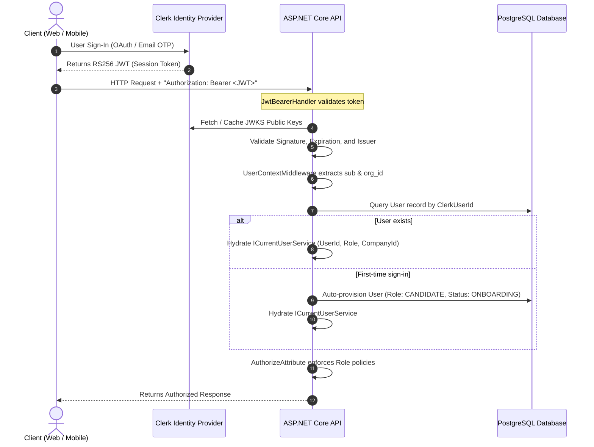

# HireWise — Security, Compliance & Tenant Isolation

> **Version:** 1.0.0  
> **Classification:** Confidential / System Architecture  
> **Target Audience:** Security Engineers, Compliance Officers, Platform Architects

---

## 1. Security Architecture Principles

HireWise handles sensitive personally identifiable information (PII), confidential hiring assessments, and corporate hiring strategies. The platform adheres to five foundational security controls:

1. **Zero-Trust Token Verification**: Every REST request and WebSocket connection validates RS256 signatures against Clerk's JSON Web Key Set (JWKS).
2. **Defensive Multi-Tenancy**: Tenant context (`CompanyId`) is cryptographically extracted from the JWT token and enforced globally via ORM query filters.
3. **Candidate Confidentiality Perimeter**: Strict architectural segregation guarantees that internal candidate evaluations, match percentages, question banks, and rubric notes are **never** transmitted to candidate endpoints or mobile interfaces.
4. **Comprehensive Non-Repudiation**: All mutating operations trigger automatic, structured audit logs capturing user IDs, timestamps, IP addresses, and state deltas.
5. **Least-Privilege Secret Management**: Production deployments utilize Google Cloud Secret Manager and Workload Identity Federation; no static cloud credentials or private keys exist on disk.

---

## 2. Authentication & Identity Lifecycle



### 2.1 Native Mobile Authentication Flow
For the Flutter mobile application (`apps/mobile`):
- Uses `clerk_flutter` and `clerk_auth` Native SDK.
- Session tokens are acquired directly through native Clerk interfaces and passed in the `Authorization: Bearer <token>` header for all Dio HTTP calls.
- SignalR WebSocket connections attach the token as a query parameter (`?access_token=<token>`), which ASP.NET Core extracts in `Program.cs` before WebSocket handshake completion.

---

## 3. Role-Based Access Control (RBAC) Matrix

| Resource / Action | Public / Anonymous | CANDIDATE | INTERVIEWER | RECRUITER | ADMIN |
|---|:---:|:---:|:---:|:---:|:---:|
| **Browse Jobs** | ✅ (Open only) | ✅ (Open only) | ✅ (Company only) | ✅ (Company all) | ✅ (Platform all) |
| **Apply to Job** | ❌ | ✅ | ❌ | ❌ | ❌ |
| **Manage Resume** | ❌ | ✅ (Own only) | ❌ | ❌ | ❌ |
| **View Evaluations** | ❌ | ❌ (Strictly hidden) | ❌ | ✅ (Company only) | ✅ |
| **Approve AI Workflows** | ❌ | ❌ | ❌ | ✅ (Company only) | ✅ |
| **View Interview Questions** | ❌ | ❌ (Strictly hidden) | ✅ (Assigned) | ✅ (Company only) | ✅ |
| **Submit Feedback Rubric** | ❌ | ❌ | ✅ (Assigned) | ✅ (Company only) | ✅ |
| **View Audit Logs** | ❌ | ❌ | ❌ | ❌ | ✅ |
| **Manage Agent Configs** | ❌ | ❌ | ❌ | ❌ | ✅ |

---

## 4. Tenant Isolation Architecture

To ensure strict tenant segregation across employers:

### 4.1 Token Scoping
When a recruiter signs into their Clerk Organization, the issued JWT contains the claim:
```json
{
  "org_id": "org_2teQJ9Z..."
}
```
The backend `UserContextMiddleware` translates `org_id` into the internal PostgreSQL `CompanyId`.

### 4.2 Entity Framework Core Query Filtering
Database queries for tenant resources are scoped at the repository/controller layer:
```csharp
if (_currentUserService.IsRecruiter)
{
    query = query.Where(x => x.CompanyId == _currentUserService.CompanyId.Value);
}
```
Cross-tenant writes are explicitly rejected with `403 Forbidden`.

---

## 5. Candidate Confidentiality Perimeter

To maintain integrity in automated hiring, the candidate experience (on both the React Web Portal and the Flutter Mobile Client) enforces strict confidentiality filters:

1. **Question Masking**: The `InterviewQuestion` table and associated endpoints (`/api/interviews/{id}/questions`) reject requests from users with the `CANDIDATE` role.
2. **Feedback Masking**: Interviewer feedback (`/api/interviews/{id}/feedback`) is inaccessible to candidates.
3. **Application Response DTOs**: Candidates receive `ApplicationDto`, which excludes internal AI evaluation scores, recruiter notes, and workflow step details.
4. **Mobile Role Guard**: If a user with role `RECRUITER`, `INTERVIEWER`, or `ADMIN` attempts to log into `apps/mobile`, the mobile router immediately presents an `UnauthorizedScreen` advising them to use the Web Portal.

---

## 6. Service-to-Service Communication Security

All communication between the ASP.NET Core API and the FastAPI AI Service is authenticated via private service headers:

- **API → FastAPI**: Requests to `/api/v1/workflows/start` include:
  ```http
  X-Api-Key: <AI_SERVICE_API_KEY>
  ```
- **FastAPI → API (Callbacks)**: Webhooks to `/api/internal/ai-callback` include:
  ```http
  X-Internal-Key: <AI_SERVICE_INTERNAL_KEY>
  ```
Endpoints return `403 Forbidden` if keys are missing or invalid. In production, both services operate within a private VPC network using Serverless VPC Access.

---

## 7. File Upload & Storage Security

Resume uploads (`/api/resumes/upload`) enforce multi-layered defense:
- **MIME & Extension Whitelist**: Only `.pdf`, `.doc`, `.docx` (`application/pdf`, `application/msword`, `application/vnd.openxmlformats-officedocument.wordprocessingml.document`).
- **File Size Limit**: Hard ceiling of 10 MB.
- **Magic Number Inspection**: Content inspection ensures file headers match legitimate PDF/DOCX magic bytes.
- **Isolated Storage**: Files are written to Google Cloud Storage buckets with uniform bucket-level access. Download URLs are authenticated or short-lived signed URLs.

---

## 8. Audit Logging & Non-Repudiation

Every mutating request generates an immutable audit record in PostgreSQL:

```json
{
  "id": "e0a12001-c519-482c-a212-68a41cebf901",
  "userId": "18cfc5f5-f55a-4e2b-bbd4-65f5e7144e5a",
  "action": "UpdateJobStatus",
  "entityType": "Job",
  "entityId": "a1b2c3d4-0000-0000-0000-000000000001",
  "role": "RECRUITER",
  "oldValuesJson": { "status": "DRAFT" },
  "newValuesJson": { "status": "OPEN" },
  "ipAddress": "192.168.1.10",
  "correlationId": "c0a8012e-8a2b-4fa8-b223-28f090b8332f",
  "createdAt": "2026-09-24T12:00:00Z"
}
```
Audit logs cannot be updated or deleted through the API.
